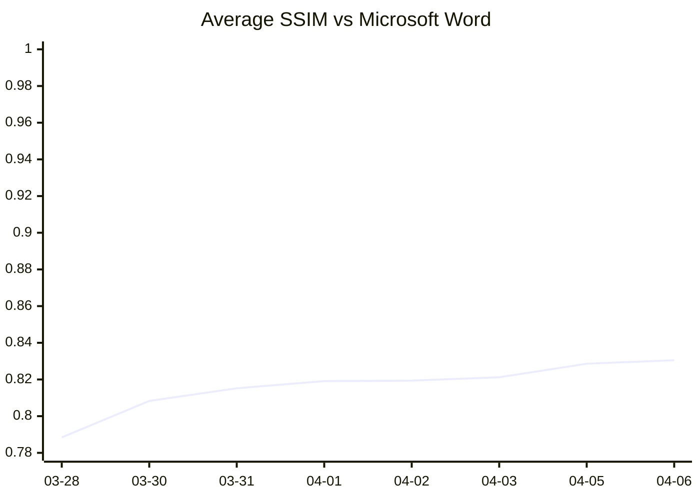

# Oxi

Open-source document processing suite built with Rust + WebAssembly
View, render, and edit .docx / .xlsx / .pptx / PDF natively in the browser — no server required

[Live Demo](https://ryujiyasu.gitlab.io/oxi/) · [Roadmap](#roadmap) · [Contributing](#contributing)

  

---

## Features

- Parse .docx, .xlsx, .pptx, PDF into a language-agnostic Intermediate Representation (IR)
- Render documents with a layout engine (paragraphs, tables, images, headers/footers, page borders)
- Edit text in .docx / .xlsx / .pptx with round-trip fidelity — original XML is preserved
- Download edited files — changes are patched into the original ZIP, not rebuilt from scratch
- PDF text extraction, structure parsing, and PDF generation
- Japanese typography — kinsoku shori (JIS X 4051), CJK font metrics
- Hanko / Inkan — Japanese digital stamp generation (round, square, oval) + PAdES PDF signatures
- 100% client-side — all processing runs in WebAssembly, nothing leaves your browser

[Try it now: Live Demo](https://ryujiyasu.gitlab.io/oxi/)

---

## Mission

> **Documents belong to their communities, not to their software vendors.**

Billions of people depend on proprietary document formats (.docx, .xlsx, .pptx, .pdf) for work, education, and government — yet no truly compatible open-source rendering engine exists. LibreOffice breaks layouts. Google Docs requires a server. The world deserves a document engine that is:

- **Free forever** — MIT license, no vendor lock-in
- **Runs anywhere** — browser, desktop, mobile, server, embedded
- **High-fidelity rendering** — based on published OOXML standards and COM API measurements
- **Private by design** — your data never leaves your device
- **Accessible** — works on low-end hardware, no installation required

Oxi doesn't reject Microsoft Word — it observes Word's behavior, reproduces it with pixel-level accuracy, and returns the power of interpretation to the communities who depend on these documents. Reclaim sovereignty. Enable diversity.

---

## Landscape — Why Not Use ...?

| Solution | Approach | Limitation |
|----------|----------|------------|
| **LibreOffice / Collabora Online** | C++ server-side rendering | Breaks Word layouts. Requires server infrastructure. No pixel-fidelity goal |
| **ZetaOffice** | LibreOffice compiled to WASM | 100MB+ download. Layout accuracy = LibreOffice quality. Not a rewrite, just a port |
| **ONLYOFFICE** | JavaScript canvas rendering | Closest architecture to Oxi, but AGPL license. No COM-measured Word compatibility |
| **Apryse (PDFTron)** | C++ → WASM viewer | Proprietary. Converts to internal format — not native OOXML rendering |
| **docMentis** | Rust+WASM viewer | WASM engine is proprietary (closed source). Telemetry on by default. No pixel-fidelity target |
| **Google Docs** | Server-rendered | Proprietary. Requires server. Intentionally diverges from Word layout |
| **docx-rs / rdocx** | Rust DOCX libraries | Read/write and export only — no layout engine for browser rendering |

**Oxi's unique combination:** OSS (MIT) + Rust/WASM client-side + COM-measured pixel-perfect Word compatibility + zero server cost. No other project occupies this intersection.

---

## Vision: The Oxi Ecosystem

Oxi's core mission is one thing: **pixel-perfect document rendering**. Everything else is an extension or a fork.

This is a **distribution model** — like Linux. Oxi provides the kernel (rendering engine) and defines two things:

1. **Pixel accuracy standards** — the quality bar for the rendering core
2. **Extension/Fork interface rules** — how add-ons plug in

Each Fork decides which Extensions to adopt, which to skip, and which to build. Oxi doesn't pick winners — communities do.

### Extensions
Extensions add functionality on top of Oxi's rendering core without compromising pixel accuracy.

Available extensions:
- **oxi-hyde** — Hardware-backed encryption + post-quantum cryptography (TPM 2.0 + ML-KEM). The only OSS that abstracts TPM + PQC at the application layer — no competing Rust crate or framework exists (as of April 2026). Key never leaves TPM hardware; ciphertext is architecturally anonymized. Targets CNSA 2.0 compliance ahead of the 2027 deadline
- **oxi-argo** — Zero-knowledge proofs for document provenance and selective disclosure
- **oxi-mcp** — Model Context Protocol integration for AI agent workflows
- **oxi-tauri** — Desktop application wrapper

### Forks
Forks are purpose-built derivatives of Oxi targeting specific use cases and user communities. Each Fork chooses which Extensions to adopt as standard — Oxi core doesn't decide for them.

| Fork | Domain | Standard Extensions | Key Value |
|------|--------|-------------------|-----------|
| **Government Oxi** | Public sector | hyde, argo | Authenticity proof for official documents, tamper detection |
| **Medical Oxi** | Healthcare | hyde, argo | Medical record rendering + signatures, patient privacy via ZKP |
| **Legal Oxi** | Law | hyde | Contract version management, signature chains, selective disclosure |
| **University Oxi** | Education | hyde, argo | AI-generated document process proof, transparent and verifiable |
| **Finance Oxi** | Financial services | hyde | High-fidelity rendering of securities reports and disclosure documents |
| **Publisher Oxi** | Publishing | — | InDesign interop, print-quality PDF output |
| **BIM Oxi** | Construction / Real estate | — | High-precision rendering of blueprints and specifications |

**Example: Government Oxi**
Japan's government runs on .docx. As public agencies digitize, tamper detection and authenticity proof become critical. Government Oxi combines Oxi's pixel-perfect rendering with hyde (PQC signatures) and argo (ZKP) to let any citizen verify that a public document is authentic — without trusting a central authority.

**Example: University Oxi**
AI-generated documents are a growing challenge in academic settings. University Oxi envisions binding the *process* of document creation — the dialogue with AI, the edit history, the human revisions — to the final submission. Using oxi + hyde + argo (ZKP), a student can prove not just *what* was submitted, but *how* it was created, without exposing the full content. This is not about banning AI — it's about making AI use transparent and verifiable.

We welcome forks that serve communities Oxi's core cannot.

### Governance (work in progress)

The distribution model requires clear rules to prevent fragmentation. These are the open design questions:

**What Oxi core defines:**
- Pixel accuracy standards — the quality bar for the rendering engine
- Extension interface specification — how Extensions plug into the WASM API
- Version compatibility guarantees — how Extensions and Forks track core updates

**What each Fork defines:**
- Which Extensions to adopt as standard
- Whether to add Fork-specific Extensions
- Community-specific policies (compliance, certification, etc.)

**Open questions:**
- Extension API design — how Extensions hook into Oxi's WASM surface without compromising rendering
- Extension registry — discovery, versioning, and quality assurance
- "Oxi" trademark usage — minimum pixel accuracy threshold for Forks to use the Oxi name
- Upstream sync — how Forks incorporate core updates (rebase, cherry-pick, or automated merge)
- Cross-Fork specification sharing — how domain knowledge discovered in one Fork benefits others

These will be documented in `docs/governance.md` as the ecosystem matures.

---

## 100% Clean-Room Implementation

Oxi's rendering engine was built without any disassembly, decompilation, or binary analysis of proprietary software.

All layout specifications are derived exclusively from two sources:

1. **Published standards** — OOXML (ISO/IEC 29500 / ECMA-376), PDF (ISO 32000)
2. **Black-box testing** — Observing output values via the Microsoft Office COM API

AI (Claude) was used throughout the specification derivation process — including root-cause analysis, COM API measurement, pattern confirmation, and fix implementation. All specification decisions are grounded exclusively in values measured via the COM API. Human review confirmed correctness at each stage.

Under Microsoft's [Open Specification Promise](https://learn.microsoft.com/en-us/openspecs/dev_center/ms-devcentlp/1c24c7c8-28b0-4ce1-a47d-95fe1ff504bc), no patents are asserted against implementations of the OOXML specification.

---

## Font Rendering Strategy

Oxi targets pixel-perfect rendering using open-licensed fonts only — no proprietary fonts are bundled or required.

**Two-tier approach:**

1. **OpenFont baseline** — All metrics (advance width, line height, kerning) are matched exactly to their Microsoft Font counterparts. Within this baseline, 100% pixel-identical rendering is guaranteed and verified by automated tests.

2. **Real-world documents** — Documents authored with Microsoft Fonts (Calibri, MS Gothic, etc.) are assessed using a **font divergence score**: a per-glyph pixel-diff table (generated once on a system with Microsoft Fonts installed) combined with character frequency in the target document. This produces a machine-calculable visual fidelity estimate without requiring proprietary fonts at runtime.

This approach keeps Oxi fully open-source and CI-friendly while honestly quantifying rendering fidelity for real-world documents.

---

## Dual Font Engine: GDI + DirectWrite

Oxi uses two font engines for different purposes:

| Format | Engine | Reason |
|--------|--------|--------|
| .docx (Word compatible) | **GDI** | Word uses GDI text metrics. Integer-pixel rounding, tmHeight line heights, hinting-dependent character widths. Pixel-identical layout requires matching GDI behavior exactly. |
| .oxidocs (Oxi native) | **DirectWrite** | Platform-independent floating-point precision. No legacy rounding artifacts. Better support for variable fonts, OpenType features, and high-DPI rendering. |
| .pdf (export) | **DirectWrite** | PDF spec uses floating-point coordinates. GDI integer rounding is unnecessary and reduces quality. |

### Why two engines?

Word's layout is built on GDI — a 30-year-old API that rounds character widths to integer pixels and computes line heights by rounding ascent and descent separately before adding them. These rounding decisions cascade: a 0.18pt/character difference at Calibri 11pt becomes 10.8pt of accumulated error over 60 characters, enough to change where lines break and pages split.

Oxi's Phase 1 goal is Word-compatible rendering, so GDI metrics are mandatory. But GDI's integer rounding is a legacy constraint, not a design virtue. For Oxi's native format (.oxidocs), DirectWrite provides:

- **Cross-platform consistency** — floating-point metrics produce identical layout on Windows, macOS, Linux, and WASM
- **Variable font support** — GDI cannot handle variable fonts; DirectWrite can
- **High-DPI rendering** — GDI's 96dpi-era rounding is meaningless on 4K/Retina displays
- **Modern typography** — many OpenType features are only accessible through DirectWrite

### Implementation

Both engines implement a shared `FontEngine` trait. The layout engine depends only on this trait, so switching between GDI and DirectWrite is a one-line configuration change per document:

```
FontEngine trait
├── GdiEngine       — Word-compatible metrics (integer px rounding)
└── DWriteEngine    — Oxi-native metrics (floating-point precision)
```

Opening a .docx → GDI engine. Creating a new .oxidocs → DirectWrite engine. Converting .docx to .oxidocs recalculates layout with DirectWrite metrics. No pixel accuracy is lost for Word documents; no legacy constraints limit Oxi-native documents.

---

## Layout Accuracy (SSIM Progress)

Oxi's layout engine is measured against Microsoft Word using SSIM (Structural Similarity Index) across 177 real-world .docx documents (437 pages). All specifications are derived from COM API black-box measurements — no DLL disassembly.



| Date | avg SSIM | Pages >= 0.90 | Pixel Perfect | Key Changes |
|------|----------|---------------|---------------|-------------|
| 2026-03-28 | 0.7884 | — | — | Baseline: 147 docs, grid snap, spacing collapse, justify, twips char width, GDI height ppem round |
| 2026-03-30 | 0.8083 | — | — | DML-driven improvement loop, GDI renderer pipeline |
| 2026-03-31 | 0.8152 | 79/157 (50%) | — | ceil_10tw line height, text_y_offset, table cell lineSpacing |
| 2026-04-01 | 0.8191 | 121/415 (29%) | — | pPr/rPr empty paragraph font, tab_stops, linesAndChars table row snap |
| 2026-04-02 | 0.8194 | 133/424 (31%) | 11/24 (45%) | Table border overhead fix, pixel perfect proof (GDI TextOutW), GDI width tables ppem 7-50 |
| 2026-04-03 | 0.8212 | — | — | CJK 83/64 eighth-pt floor, charGrid pitch, charSpace 1/4096pt, header overflow fix, margin 10tw rounding, field result dedup |
| 2026-04-04 | 0.8286 | 150/437 (34%) | — | pBdr border overhead bw/2, bullet marker size fix, docDefaults lineSpacing table cell reset, DML diff accuracy improvements |
| 2026-04-05 | **0.8305** | 155/437 (35%) | — | Multiple spacing cumulative ceil, beforeLines/afterLines grid snap fix, COM line height table correction, GDI character_spacing |

**Method**: Word PDF export (150dpi) vs Oxi GDI renderer (TextOutW, 150dpi). COM-confirmed specifications only — no speculation.

**DML structural comparison**: 177 documents cached. Paragraph Y, line-break positions, and table row heights compared using `layout_json --structure` and `dml_diff.py`.

---

## Architecture

```
crates/
  oxi-common/         Shared OOXML utilities (ZIP, XML, relationships)
  oxidocs-core/       .docx engine — parser, IR, layout, font metrics, editor
  oxicells-core/      .xlsx engine — parser, IR, editor
  oxislides-core/     .pptx engine — parser, IR, editor
  oxipdf-core/        PDF 1.7 engine — parser, text extraction, generator
  oxihanko/           Japanese digital stamp (hanko) generator + PAdES signer
  oxi-wasm/           WebAssembly bindings (wasm-bindgen)
web/                  Web demo (vanilla JS + Canvas)
tools/
  font-metrics-gen/   Standalone tool to extract font metrics from system fonts
  font-glyph-diff-gen/ Per-glyph pixel-diff table for Microsoft Font divergence scoring
  metrics/            Line-height analysis scripts and data
tests/fixtures/       Test .docx / .xlsx / .pptx files
```

---

## IR Design

The Intermediate Representation is language-agnostic and does not depend on Word/Excel/PowerPoint internals:

```
Document → Page → Block (Paragraph | Table | Image) → Run
```

---

## Round-Trip Editing

Original ZIP archives are preserved. Only the specific XML text nodes that changed are patched:

| Format | Coordinate System | Patched Element |
|--------|-------------------|-----------------|
| .docx  | (paragraph, run)  | `<w:t>` text nodes |
| .xlsx  | (sheet, row, col) | `<c>` cell values (inline string) |
| .pptx  | (slide, shape, paragraph, run) | `<a:t>` text nodes |

---

## WASM API

All processing is exposed via wasm-bindgen and can be called directly from JavaScript:

```javascript
import init, {
  parse_document,        // .docx → IR (JSON)
  parse_spreadsheet,     // .xlsx → IR (JSON)
  parse_presentation,    // .pptx → IR (JSON)
  layout_document,       // .docx → positioned layout with coordinates
  edit_docx,             // apply text edits → new .docx bytes
  edit_xlsx,             // apply cell edits → new .xlsx bytes
  edit_pptx,             // apply slide edits → new .pptx bytes
  create_blank_docx,     // generate empty .docx
  parse_pdf,             // PDF → structure (JSON)
  pdf_extract_text,      // PDF → plain text
  create_pdf,            // generate PDF from scratch
  pdf_verify_signatures, // verify PDF signatures
  generate_hanko_svg,    // generate stamp SVG with custom config
  preview_hanko,         // quick stamp preview by name
} from "./oxi_wasm.js";

await init();
const bytes = new Uint8Array(await (await fetch("sample.docx")).arrayBuffer());
const layout = layout_document(bytes); // positioned elements for canvas rendering
```

---

## Quick Start

### Prerequisites
- Rust 1.93+
- wasm-pack 0.14+

### Build & Test

```bash
cargo build                          # Build all crates
cargo test                           # Run tests
cargo clippy                         # Lint
```

### Build Wasm & Run Demo

```bash
cd crates/oxi-wasm
wasm-pack build --target web         # Build .wasm + JS bindings

cd ../../web
python3 -m http.server 8080          # Serve at http://localhost:8080
```

---

## Tech Stack

| Layer | Technology |
|-------|------------|
| Core engines | Rust (memory-safe, zero-cost abstractions) |
| XML parsing | quick-xml |
| ZIP handling | zip crate |
| Serialization | serde / serde_json |
| Browser bindings | wasm-bindgen + wasm-pack |
| Font metrics | Generated at build time from user's local system fonts via tools/font-metrics-gen |
| Web demo | Vanilla JS + Canvas (no framework dependencies) |

---

## Golden Tests — 504 Files, 100% Parse Success

Tested against 504 real-world government documents (Japanese ministries) + generated files:

|        | Oxi    | LibreOffice |
|--------|--------|-------------|
| Overall | 100.0% | 99.2% |
| DOCX   | 100.0% | 100.0% |
| XLSX   | 100.0% | 98.6% |
| PPTX   | 100.0% | 100.0% |

LibreOffice timed out (>45s) on 4 large government xlsx files. Oxi parsed all instantly.

---

## Roadmap

### v1 — Foundation (current)
- .docx / .xlsx / .pptx parser & language-agnostic IR
- .docx layout engine (paragraphs, tables, images, headers/footers, page borders)
- Japanese typography (kinsoku shori, CJK punctuation compression)
- Round-trip editing (.docx structural editing, .xlsx/.pptx basic text editing)
- PDF parse, text extraction, generation, PAdES signatures
- Hanko (Japanese digital stamp) SVG generation
- WASM build + unified Canvas editor (click-to-edit, instant re-layout)
- Basic formula evaluation (.xlsx: SUM, AVERAGE, IF, etc.)
- Ra autonomous specification loop (COM-measured Word compatibility)

### v1.x — Word Parity
- .docx layout accuracy → SSIM 0.95+ (Ra loop continues)
- IME (Japanese/CJK input) support in Canvas editor
- Text selection & formatting toolbar integration
- .xlsx layout engine (cell rendering, charts)
- .pptx layout engine (slide rendering, masters)
- Vertical writing & ruby (furigana)

### v2 — oxidocs Native Format

**Architectural Guarantee: oxidocs core can always be losslessly converted to .docx.**

oxidocs is Oxi's native document format, designed with two explicit layers:

```
oxidocs
├── core layer   Word-compatible fields. Owned by Oxi core. Forks cannot modify.
│                Always exportable to .docx.
└── ext layer    Fork/Extension additions. On .docx export: customXml/ or discard.
```

**Output patterns:**

| Pattern | Format | Use case | Compatibility |
|---------|--------|----------|---------------|
| A | .docx + oxi extensions in customXml/ | External sharing, submission, archive | Opens in all Word clients |
| B | .oxidocs (native, optimized) | Internal storage, Fork sharing, waterdocs base | Smaller than .docx. Always convertible to Pattern A |

Like Git's loose objects vs packfiles — internal format is optimized, external output is the interchange format.

**v2 deliverables:**
- [ ] oxidocs specification (core layer / ext layer definition)
- [ ] oxidocs ↔ .docx bidirectional conversion (Pattern A / B)
- [ ] oxidocs-to-docx Generator (full generation, no original file required)
- [ ] Dual font engine: GDI for .docx, DirectWrite for .oxidocs
- [ ] docs/governance.md: Architectural Guarantee formalized

### v2.x — waterdocs (oxidocs + hyde encryption)

```
waterdocs
├── core layer (after decryption → .docx exportable)
└── hyde layer (encryption metadata, not included in .docx)
```

- [ ] waterdocs format definition (oxi-hyde Extension)
- [ ] Encryption/decryption flow preserving core layer guarantee
- [ ] oxi-hyde integration as standard Extension

### Future
- oxi-argo (zero-knowledge proofs for document provenance)
- oxi-mcp (AI agent workflow integration)
- Desktop application (oxi-tauri)

### Ra: No Excuses by Design

Oxi's Word compatibility is not aspirational — it is mechanically guaranteed to converge.

- Word's layout is **deterministic** — same input always produces the same output
- Every value is **measurable** via the COM API — Y coordinates, line heights, character widths, paragraph spacing
- Every visual difference between Oxi and Word maps to a **finite, identifiable specification gap**
- Fixing one specification gap often improves **multiple documents simultaneously** (convergent structure)
- Measurement results are **permanent assets** — once a behavior is COM-measured and committed, it never needs to be re-derived

This is not "best effort." It is a closed loop where "not yet implemented" is the only valid state, and "cannot implement" does not exist. The question is never *if* Oxi will match Word, only *when* — determined by measurement count and implementation time.

### Implementation Gap: oxidocs-to-docx Generator

The most critical task for v2. Without a complete generator that can produce valid .docx from any oxidocs without the original file, the Architectural Guarantee is aspirational, not real.

`create_blank_docx` is the foundation. The generator must map every oxidocs core field to OOXML. Ra's reverse-engineered specifications feed directly into this — every COM-measured behavior becomes a generation rule.

### Governance Impact

The following will be added to docs/governance.md:
- **oxidocs schema ownership** — core layer definition is owned by Oxi core; Forks cannot modify it
- **ext layer export policy** — each Fork must declare how its Extensions behave on .docx export (customXml / discard / error)
- **waterdocs core/Extension boundary** — encryption is an Extension, but post-decryption core layer guarantee is Oxi core's responsibility

---

## Contributing

Contributions are welcome. Oxi has a simple acceptance criterion:

**Every merged PR must improve the pixel accuracy of at least one document.**

### What belongs in core
1. Pixel accuracy improvements to existing layout engine
2. New test documents with low pixel accuracy (must use OpenFont, improvement tracked via Issue)
3. New OpenFont additions (Microsoft Font metric parity verification required)
4. Format engine additions: .xlsx layout, .pptx layout, vertical writing, etc.

### What belongs in an Extension or Fork
Features that go beyond pixel-accurate rendering — collaboration, AI integration, desktop apps, purpose-specific workflows — belong in an Extension or Fork, not in Oxi core.

See [Vision: The Oxi Ecosystem](#vision-the-oxi-ecosystem) for the distinction between Extensions and Forks.

### How to contribute
1. Fork the repository
2. Create a feature branch (`git checkout -b feature/amazing-feature`)
3. Run tests and lint (`cargo test && cargo clippy`)
4. Submit a pull request with pixel accuracy results

---

## Why Rust + Wasm?

- **Performance** — native-speed document parsing and layout in the browser
- **Memory safety** — no buffer overflows, no use-after-free, no data races
- **Small binary** — the compiled .wasm is ~1.4 MB for the entire suite
- **Zero server cost** — all processing runs client-side, no backend needed
- **Privacy** — documents never leave the user's device

---

## License

MIT
