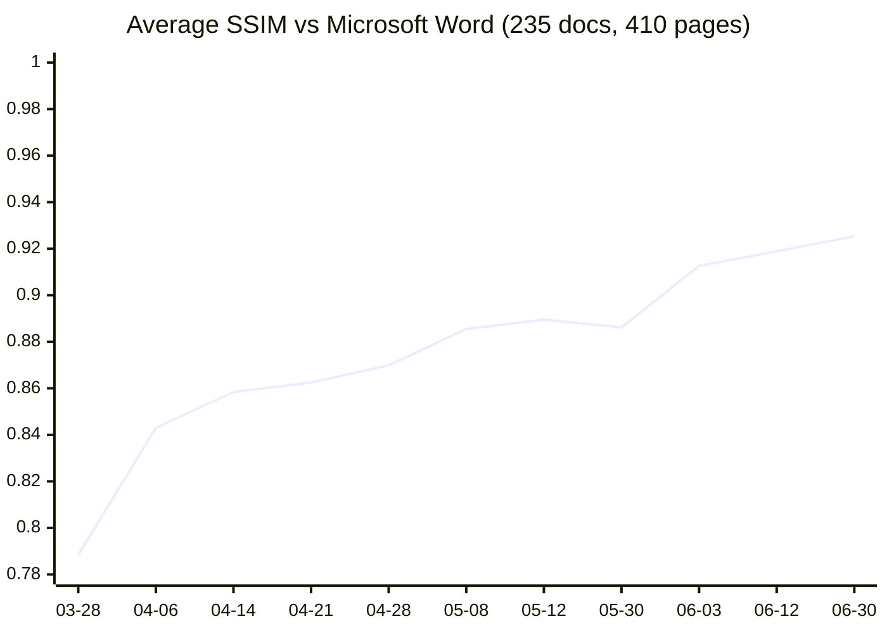

# Oxi

**Oxi = Opensource Xplatform Interoperability**

A document processing suite built with Rust + WebAssembly.
View, render, and edit .docx / .xlsx / .pptx / PDF natively in the browser — no server required.

[Live Demo](https://ryujiyasu.gitlab.io/oxi/) · [Roadmap](#roadmap) · [Contributing](#contributing)

  

---

## Features

- Parse .docx, .xlsx, .pptx, PDF into a language-agnostic Intermediate Representation (IR)
- Render documents with a layout engine (paragraphs, tables, images, headers/footers, page borders)
- Edit text in .docx / .xlsx / .pptx with round-trip fidelity — original XML is preserved
- Download edited files — changes are patched into the original ZIP, not rebuilt from scratch
- PDF text extraction, structure parsing, and PDF generation
- Japanese typography — kinsoku shori (JIS X 4051), CJK font metrics, vertical writing (tategaki), tate-chu-yoko (縦中横), ruby (furigana), warichu (割注), emphasis marks (圏点)
- Rich character & paragraph formatting — run/paragraph shading, character borders (w:bdr), text effects (shadow / emboss / imprint / outline), small-caps, drop caps, tab leaders
- Hanko / Inkan — Japanese digital stamp generation (round, square, oval) + PAdES PDF signatures
- 100% client-side — all processing runs in WebAssembly, nothing leaves your browser

[Try it now: Live Demo](https://ryujiyasu.gitlab.io/oxi/)

---

## Mission

> **Documents belong to their communities, not to their software vendors.**

Billions of people depend on proprietary document formats (.docx, .xlsx, .pptx, .pdf) for work, education, and government — yet no truly compatible open-source rendering engine exists. LibreOffice breaks layouts. Google Docs requires a server. The world deserves a document engine that is:

- **Free forever** — MPL-2.0 core (improvements to the engine flow back to everyone; embedding stays free), MIT/Apache-2.0 bindings, no vendor lock-in
- **No proprietary format** — Oxi reads and writes only standard formats (.docx / .odt / .xlsx / .pptx / .pdf). Oxi never asks anyone to migrate into an Oxi-specific container
- **Both ODF and OOXML are first-class** — neither is a second-class import
- **Runs anywhere** — browser, desktop, mobile, server, embedded
- **High-fidelity rendering** — based on published ODF / OOXML standards and COM API measurements
- **Private by design** — your data never leaves your device
- **Accessible** — works on low-end hardware, no installation required

Oxi doesn't reject Microsoft Word — it observes Word's behavior, reproduces it with pixel-level accuracy, and returns the power of interpretation to the communities who depend on these documents. The same loop applies to ODF: empirical fidelity to a reference renderer, pinned by measurement, not speculation. Reclaim sovereignty. Enable diversity.

---

## Why Now

Europe is actively dismantling its Microsoft Office dependency in 2026:

- **France** — DINUM directive (2026-04-08) mandates that 2.5M public-sector PCs migrate to free-software stacks by 2027; each ministry submits a roadmap by autumn 2026; Microsoft Teams and Zoom are already blocked on the inter-ministerial network (RIE). 20 years of Gendarmerie Nationale GendBuntu (97% of 103,164 PCs migrated) is the reference model.
- **Switzerland** — The Federal Chancellery (Bundeskanzlei) officially announced (2026-04-18) a phased, long-term reduction of Microsoft 365 dependency. The BOSS (Büroautomation durch Einsatz von Open-Source-Software) feasibility study delivers mid-2026. Germany's ZenDiS OpenDesk is the named reference implementation.
- **Germany** — ZenDiS OpenDesk is already in production at Schleswig-Holstein, Thüringen, Baden-Württemberg, and — after US sanctions blocked Microsoft access earlier this year — the International Criminal Court.

Every one of these transitions is missing the same piece: **a rendering engine that opens existing .docx files identically to Microsoft Word**, so that "migration" stops being a project and becomes indistinguishable from switching applications. LibreOffice's 20-year struggle in public-sector rollouts is well-documented — not because its features are weak, but because per-document visual divergence forces every organization into a per-file audit it cannot staff.

Oxi's Ra loop is a mechanical convergence toward SSIM = 1.0 against Microsoft Word. Not a better migration tool — the dissolution of the migration problem.

---

## Landscape — Why Not Use ...?

| Solution | Approach | Limitation |
|----------|----------|------------|
| **LibreOffice / Collabora Online** | C++ server-side rendering | Breaks Word layouts. Requires server infrastructure. No pixel-fidelity goal |
| **ZetaOffice** | LibreOffice compiled to WASM | 100MB+ download. Layout accuracy = LibreOffice quality. Not a rewrite, just a port |
| **ONLYOFFICE** | JavaScript canvas rendering | Closest architecture to Oxi, but AGPL license. No COM-measured Word compatibility |
| **Apryse (PDFTron)** | C++ → WASM viewer | Proprietary. Converts to internal format — not native OOXML rendering |
| **docMentis** | Rust+WASM viewer | WASM engine is proprietary (closed source). Telemetry on by default. No pixel-fidelity target |
| **Google Docs** | Server-rendered | Proprietary. Requires server. Intentionally diverges from Word layout |
| **docx-rs / rdocx** | Rust DOCX libraries | Read/write and export only — no layout engine for browser rendering |

**Oxi's unique combination:** OSS (MPL-2.0 core + permissive bindings — embeddable in proprietary products, unlike AGPL) + Rust/WASM client-side + dual-format first-class (.docx + .odt, no proprietary "Oxi format") + COM-measured pixel-perfect Word compatibility + zero server cost. No other project occupies this intersection.

LibreOffice treats ODF as native and OOXML as an import (round-trip degrades). Microsoft Word inverts that. Oxi's IR is format-agnostic from the start — neither format owns it, so neither degrades on round-trip.

---

## Vision: The Oxi Ecosystem

Oxi's core mission is one thing: **pixel-perfect document rendering**. Everything else is an extension or a fork.

This is a **distribution model** — like Linux. Oxi provides the kernel (rendering engine) and defines two things:

1. **Pixel accuracy standards** — the quality bar for the rendering core
2. **Extension/Fork interface rules** — how add-ons plug in

Each Fork decides which Extensions to adopt, which to skip, and which to build. Oxi doesn't pick winners — communities do.

### Extensions
Extensions add functionality on top of Oxi's rendering core without compromising pixel accuracy.

Available extensions:
- **oxi-hyde** — Hardware-backed encryption + post-quantum cryptography (TPM 2.0 + ML-KEM). The only OSS that abstracts TPM + PQC at the application layer — no competing Rust crate or framework exists (as of April 2026). Key never leaves TPM hardware; ciphertext is architecturally anonymized. Targets CNSA 2.0 compliance ahead of the 2027 deadline
- **oxi-argo** — Zero-knowledge proofs for document provenance and selective disclosure
- **oxi-mcp** — Model Context Protocol integration for AI agent workflows
- **oxi-tauri** — Desktop application wrapper

### Forks
Forks are purpose-built derivatives of Oxi targeting specific use cases and user communities. Each Fork chooses which Extensions to adopt as standard — Oxi core doesn't decide for them.

| Fork | Domain | Standard Extensions | Key Value |
|------|--------|-------------------|-----------|
| **Government Oxi** | Public sector | hyde, argo | Authenticity proof for official documents, tamper detection |
| **Medical Oxi** | Healthcare | hyde, argo | Medical record rendering + signatures, patient privacy via ZKP |
| **Legal Oxi** | Law | hyde | Contract version management, signature chains, selective disclosure |
| **University Oxi** | Education | hyde, argo | AI-generated document process proof, transparent and verifiable |
| **Finance Oxi** | Financial services | hyde | High-fidelity rendering of securities reports and disclosure documents |
| **Publisher Oxi** | Publishing | — | InDesign interop, print-quality PDF output |
| **BIM Oxi** | Construction / Real estate | — | High-precision rendering of blueprints and specifications |

**Example: Government Oxi**
Japan's government runs on .docx. As public agencies digitize, tamper detection and authenticity proof become critical. Government Oxi combines Oxi's pixel-perfect rendering with hyde (PQC signatures) and argo (ZKP) to let any citizen verify that a public document is authentic — without trusting a central authority.

**Example: University Oxi**
AI-generated documents are a growing challenge in academic settings. University Oxi envisions binding the *process* of document creation — the dialogue with AI, the edit history, the human revisions — to the final submission. Using oxi + hyde + argo (ZKP), a student can prove not just *what* was submitted, but *how* it was created, without exposing the full content. This is not about banning AI — it's about making AI use transparent and verifiable.

We welcome forks that serve communities Oxi's core cannot.

### Governance (work in progress)

The distribution model requires clear rules to prevent fragmentation. These are the open design questions:

**What Oxi core defines:**
- Pixel accuracy standards — the quality bar for the rendering engine
- Extension interface specification — how Extensions plug into the WASM API
- Version compatibility guarantees — how Extensions and Forks track core updates

**What each Fork defines:**
- Which Extensions to adopt as standard
- Whether to add Fork-specific Extensions
- Community-specific policies (compliance, certification, etc.)

**Open questions:**
- Extension API design — how Extensions hook into Oxi's WASM surface without compromising rendering
- Extension registry — discovery, versioning, and quality assurance
- "Oxi" trademark usage — minimum pixel accuracy threshold for Forks to use the Oxi name
- Upstream sync — how Forks incorporate core updates (rebase, cherry-pick, or automated merge)
- Cross-Fork specification sharing — how domain knowledge discovered in one Fork benefits others

These will be documented in `docs/governance.md` as the ecosystem matures.

---

## 100% Clean-Room Implementation

Oxi's rendering engine was built without any disassembly, decompilation, or binary analysis of proprietary software.

All layout specifications are derived exclusively from two sources:

1. **Published standards** — OOXML (ISO/IEC 29500 / ECMA-376), PDF (ISO 32000)
2. **Black-box testing** — Observing output values via the Microsoft Office COM API

AI (Claude) was used throughout the specification derivation process — including root-cause analysis, COM API measurement, pattern confirmation, and fix implementation. All specification decisions are grounded exclusively in values measured via the COM API. Human review confirmed correctness at each stage.

Under Microsoft's [Open Specification Promise](https://learn.microsoft.com/en-us/openspecs/dev_center/ms-devcentlp/1c24c7c8-28b0-4ce1-a47d-95fe1ff504bc), no patents are asserted against implementations of the OOXML specification.

---

## Font Rendering Strategy

Oxi targets pixel-perfect rendering using open-licensed fonts only — no proprietary fonts are bundled or required.

**Two-tier approach:**

1. **OpenFont baseline** — All metrics (advance width, line height, kerning) are matched exactly to their Microsoft Font counterparts. Within this baseline, 100% pixel-identical rendering is guaranteed and verified by automated tests.

2. **Real-world documents** — Documents authored with Microsoft Fonts (Calibri, MS Gothic, etc.) are assessed using a **font divergence score**: a per-glyph pixel-diff table (generated once on a system with Microsoft Fonts installed) combined with character frequency in the target document. This produces a machine-calculable visual fidelity estimate without requiring proprietary fonts at runtime.

This approach keeps Oxi fully open-source and CI-friendly while honestly quantifying rendering fidelity for real-world documents.

---

## Dual Font Engine: GDI + DirectWrite

Oxi uses two font engines for different purposes:

| Format | Engine | Reason |
|--------|--------|--------|
| .docx (Word compatible) | **GDI** | Word uses GDI text metrics. Integer-pixel rounding, tmHeight line heights, hinting-dependent character widths. Pixel-identical layout requires matching GDI behavior exactly. |
| .odt (ODF) | **DirectWrite** | ODF rendering is not anchored to a single canonical engine the way .docx is to Word. DirectWrite's floating-point metrics give cross-platform consistency without inheriting GDI's legacy rounding constraints. |
| .pdf (export) | **DirectWrite** | PDF spec uses floating-point coordinates. GDI integer rounding is unnecessary and reduces quality. |

### Why two engines?

Word's layout is built on GDI — a 30-year-old API that rounds character widths to integer pixels and computes line heights by rounding ascent and descent separately before adding them. These rounding decisions cascade: a 0.18pt/character difference at Calibri 11pt becomes 10.8pt of accumulated error over 60 characters, enough to change where lines break and pages split.

Oxi's Phase 1 goal is Word-compatible rendering, so GDI metrics are mandatory. But GDI's integer rounding is a legacy constraint, not a design virtue. For ODF rendering and PDF export, DirectWrite provides:

- **Cross-platform consistency** — floating-point metrics produce identical layout on Windows, macOS, Linux, and WASM
- **Variable font support** — GDI cannot handle variable fonts; DirectWrite can
- **High-DPI rendering** — GDI's 96dpi-era rounding is meaningless on 4K/Retina displays
- **Modern typography** — many OpenType features are only accessible through DirectWrite

### Implementation

Both engines implement a shared `FontEngine` trait. The layout engine depends only on this trait, so switching between GDI and DirectWrite is a one-line configuration change per document:

```
FontEngine trait
├── GdiEngine       — Word-compatible metrics (integer px rounding)
└── DWriteEngine    — Cross-platform metrics (floating-point precision)
```

Opening a .docx → GDI engine. Opening an .odt or exporting to PDF → DirectWrite engine. No pixel accuracy is lost for Word documents; no legacy constraints limit cross-platform formats.

---

## Layout Accuracy (SSIM Progress)

Oxi's layout engine is measured against Microsoft Word using pixel-level SSIM across 235 real-world .docx documents (410 pages). All specifications are derived from COM API black-box measurements — no DLL disassembly.



> The small step at **05-30** is not a regression: Phase 3 recomputed a clean
> SSIM baseline from scratch, so points before and after that date sit on
> slightly different measurement bases. **06-30** is the current per-page mean
> over scored pages (per-doc mean **0.9487**).

| Date | avg SSIM | gate / Phase | Key Changes |
|------|----------|--------------|-------------|
| 2026-03-28 | 0.7884 | bottom-5 sum | Baseline: grid snap, spacing collapse, justify, GDI metrics |
| 2026-04-06 | **0.8430** | bottom-5 sum | LM0 line height, docGrid no-type, font alias, eastAsia fallback |
| 2026-04-10 | **0.8520** | bottom-5 sum | leftChars indent, fullwidth symbols, font unification |
| 2026-04-14 | **0.8584** | bottom-5 sum 2.8035 | 12 new OOXML elements, 10tw char width, cumulative raw model |
| 2026-04-18 | **0.8597** | bottom-5 sum 3.0597 | 4-agent parallel session: CJK wrap strict overflow, empty-br stub, hanging-indent, row-height, yakumono compat15 gate (+0.2562 bottom-5) |
| 2026-04-21 | **0.8625** | bottom-5 sum 3.2451 | LM0 first-line centering (Bug A, `(line_h - fontSize)/2` offset scales with font size — 46 gen2_* Title docs no longer -4.32pt shifted); footer first-type phantom fix |
| 2026-04-28 | **0.8699** | **Phase 1** (pagination) | Methodology redesign: gate moves from bottom-5 SSIM sum to per-doc page-match correctness. Bottom-5 cascade plateau (R21-R34) revealed SSIM single-gate cannot move past structural mismatches. Phase 1 measures whether each Word paragraph lands on the same page as Oxi |
| 2026-05-08 | **0.8855** | Phase 1 37/55 | Day 14 leading-ws absorbs indent (+0.0098), Day 16 cs inheritance (+0.1066), Day 18 broad merge_run_style (+0.0252), Day 26 table row grid-snap removal (+0.2138), Day 28 adjustLineHeightInTable flag-conditional cell snap rule, Day 29f Times New Roman space data fix |
| 2026-05-12 | **0.8893** | **Phase 1 43/55** | Day 33 part 57 wrap_w uses cell_w (191cb + 1636 PASS), Day 33 part 59 page-break order fix preserves current-line text on hard break (cb8be7 PASS). Phase A+B (cursor advance + page-break decision precision) refactor commitment producing first concrete wins after 7+ sessions of investigation |
| 2026-05-12 | 0.8893 | Phase 1 42/55 (corrected) | Day 33 part 62 measurer fix: `measure_pagination_oxi.py` text concat now sorts by (y, x) instead of x-only — previously, multi-line wrapped paragraphs had their characters interleaved across lines, making the matcher unable to align them with Word. Fix tipped 04b88e to PASS, but revealed 3 docs (31420af, b837808, db9ca18) that previously appeared PASS due to insufficient matches. Methodology correction, not a layout regression |
| 2026-05-12 | **0.8892** | **Phase 1 43/55** | Day 33 part 65 (R7.18): body page-break check now uses natural line height (ascent+descent, no grid leading) instead of full grid line height — Word allows the leading portion of a grid-snapped line to extend into the bottom margin. COM-verified via db9ca18 paragraph 37: Word fits a line at y=758 whose grid bottom is 776 (5.25pt past pgBot 771). Companion fix: widow_control inheritance now propagates the explicit flag through the style chain, so widowControl=0 set on Normal correctly disables the orphan check for descendants. db9ca18 FAIL→PASS (3 pages matching Word). 0 PASS→FAIL transitions |
| 2026-05-12 | **0.8895** | **Phase 1 44/55** | Day 33 part 69 (R7.24): preserve fixed-layout (`<w:tblLayout w:type="fixed"/>`) table column widths — previously Oxi shrank the last column when grid_columns sum exceeded content_width (correct for autofit, wrong for fixed). 7-session a47e6 investigation: 21.1pt wrap-width loss caused "fullwidth+年月日" paragraph to overflow by 0.55pt → wrap to 2 lines, +25pt row 0 over-pump, +1.4pt at pi=2 → +1 page. 1-line fix tipped a47e6 to PASS (0.5 → 1.0) and improved d4d126 (0.8 → 0.857). Methodology lesson: estimate-vs-render diagnostic ≠ real cause; render-vs-render is the correct layer |
| 2026-05-12 | **0.8932** | **Phase 1 46/55** | Day 33 part 71 (R7.28): vMerge=restart cells excluded from row height (both estimate and render-side max). Word distributes a vMerge=restart cell's content across the entire vMerge span; the restart row's own height is set by non-merged cells. COM-verified on de6e t5 row 13 (Word 33pt, Oxi was 238pt → now 32.35pt). Previously vMerge=continue was already excluded; this commit extends the same rule to "restart". Phase 1: 31420af FAIL→PASS (0.8→1.0), 6514 FAIL→PASS (0.529→1.0); a1d6 0.556→0.875 (still FAIL, 1 outlier from PASS). 0 PASS→FAIL. Mean SSIM net +0.0037 across 410 pages. Two-line fix at mod.rs:5707 + 6404 |
| 2026-05-29 | — | **Phase 1 54/55** | Continued pagination fixes (cell-paragraph spacing collapse S427, etc.) lift Phase 1 to 54/55. The only remaining FAIL is `3a4f9f`, a split-table document Oxi paginates to 94 pages vs Word's 8 |
| 2026-05-29 | — | **Phase 2** (element IoU) | Gate moves to per-element bounding-box IoU; plateaus at mean IoU ≈ **0.9692**. Phase 2's median-dy subtraction absorbs uniform per-table offsets, so the IoU ≥ 0.99 entry bar proved structurally unreachable — which is precisely why the real remaining error (a uniform table-top offset, visible only in pixels) was invisible to it. See [CLAUDE.md](CLAUDE.md) |
| 2026-05-30 | per-page **0.8862** · per-doc **0.9235** | **Phase 3** (SSIM) | Primary gate switches back to pixel SSIM (mean ≥ 0.99 + bottom-N floor) on a freshly recomputed baseline. SSIM is the only metric that sees the uniform table-top offset Phase 2 hid. Phase 1 (54/55) and Phase 2 (0.9692) are kept as regression sentinels |
| 2026-06-03 | per-page **0.9126** | **Phase 3** · Phase 1 54/55 | R35 yakumono capacity-budget line breaking (S475/S476, docGrid `lines`+`linesAndChars`), then a 36-doc correctness sweep shipping localized coverage fixes: floating-textbox z-order (S478), 144 pt footnote separator (S479), dash-dot art borders (S480), explicit nil-cell-border suppression (S482), Word "final" revision view (S483), **upright CJK vertical writing** (S489), ellipse ○ option-markers (S490) |
| 2026-06-12 | per-page **0.9189** | **Phase 3** · Phase 1 54/55 | Two weeks of COM-measured spec re-derivations (S495-S548): `lineRule=exact` text bottom-aligns in its box (S495), cell inline images (S533), inline drawing canvases (S535/S537), three justification bugs — style-chain `jc` inheritance, explicit `jc=left` vs style default, jc-left natural breaks (S539/S540) — demand *oikomi* with a line-total fs/2 budget under Word-2010 compat (S543-S546), **character-width trio**: UPM-256 halfwidth = fs/2 exact, autoSpaceDE/DN = fs/4 true-space, yakumono pair-halving gated on `w:kern` with the full 26×26 pair table (S546/S547), compat-15 oidashi-not-burasagari + exact-line page-break threshold (S548). The single Phase-1 FAIL (`3a4f9f`) is down to 3 paragraphs (one page early), all traced to the inline-image text-line model |
| 2026-06-30 | per-page **0.9253** · per-doc **0.9487** | **Phase 3** · Phase 1 86/87 | Corpus expanded to 87 body-text docs (Phase 1) / 238 SSIM-scored docs. A long pagination + fidelity run (S559-S707): the *char-budget wall* (per-line 約物 demand-compression model, derived from a controlled synthetic dataset + Word-PDF render-truth — gate, mechanism, half-em/0.32em caps, ぶら下げ), the **form-family row-height re-derivation** (drift is a cell-tcBorder border-box overhead, not CJK line-height — S648/S660/S661/S666), the **gen2/Latin vertical & horizontal stack** (no-type-docGrid hhea line height S671, render-x word separation S672, glyph-centering S614/S670, DWrite kerning-off S668), **font substitution** (Latin-only eastAsia → MS Mincho S634, embedded Zen Old Mincho S612z), multi-column + vertical/bidi section flow (S637/S638/S678/S679), and a coverage sweep graduating **vertical writing, tate-chu-yoko (縦中横), ruby, warichu (割注), emphasis marks, run/paragraph shading, and character borders** (S654-S707). Found increasingly via a Word-vs-LibreOffice bug-finder (pages where LibreOffice ≈ Word but Oxi ≠ Word = a fixable Oxi bug) and a feature-injection perturbation harness. The sole remaining Phase-1 FAIL (`tokyoshugyo`) is the legacy compat≤14 約物-oikomi body wrap |

**Phase-based gate** (since 2026-04-28): the merge gate is currently **Phase 3 — pixel SSIM** (mean ≥ 0.99 + bottom-N floor), active since 2026-05-30. Earlier phases are kept as regression sentinels: **Phase 1** pagination correctness (per-paragraph page match, 54/55) and **Phase 2** element IoU (mean 0.9692). Phases 1 and 2 each plateaued below their entry bars for structural reasons — pagination on one split-table outlier, IoU because its median-dy subtraction hides uniform table offsets — so the gate advanced to the metric that can see the remaining pixel error. The phase-based methodology is documented in [CLAUDE.md](CLAUDE.md) under "Merge gate".

For detailed daily progress, COM-confirmed specifications, and DML structural comparison results, see [docs/layout_accuracy.md](docs/layout_accuracy.md) and [RESEARCH_LOG.md](RESEARCH_LOG.md).

---

## Architecture

```
crates/
  oxi-common/         Shared OOXML utilities (ZIP, XML, relationships)
  oxidocs-core/       .docx engine — parser, IR, layout, font metrics, editor
  oxicells-core/      .xlsx engine — parser, IR, editor
  oxislides-core/     .pptx engine — parser, IR, editor
  oxipdf-core/        PDF 1.7 engine — parser, text extraction, generator
  oxihanko/           Japanese digital stamp (hanko) generator + PAdES signer
  oxi-wasm/           WebAssembly bindings (wasm-bindgen)
web/                  Web demo (vanilla JS + Canvas)
tools/
  font-metrics-gen/   Standalone tool to extract font metrics from system fonts
  font-glyph-diff-gen/ Per-glyph pixel-diff table for Microsoft Font divergence scoring
  metrics/            Line-height analysis scripts and data
tests/fixtures/       Test .docx / .xlsx / .pptx files
```

---

## IR Design

The Intermediate Representation is language-agnostic and does not depend on Word/Excel/PowerPoint internals:

```
Document → Page → Block (Paragraph | Table | Image) → Run
```

---

## Round-Trip Editing

Original ZIP archives are preserved. Only the specific XML text nodes that changed are patched:

| Format | Coordinate System | Patched Element |
|--------|-------------------|-----------------|
| .docx  | (paragraph, run)  | `<w:t>` text nodes |
| .xlsx  | (sheet, row, col) | `<c>` cell values (inline string) |
| .pptx  | (slide, shape, paragraph, run) | `<a:t>` text nodes |

---

## WASM API

All processing is exposed via wasm-bindgen and can be called directly from JavaScript:

```javascript
import init, {
  parse_document,        // .docx → IR (JSON)
  parse_spreadsheet,     // .xlsx → IR (JSON)
  parse_presentation,    // .pptx → IR (JSON)
  layout_document,       // .docx → positioned layout with coordinates
  edit_docx,             // apply text edits → new .docx bytes
  edit_xlsx,             // apply cell edits → new .xlsx bytes
  edit_pptx,             // apply slide edits → new .pptx bytes
  create_blank_docx,     // generate empty .docx
  parse_pdf,             // PDF → structure (JSON)
  pdf_extract_text,      // PDF → plain text
  create_pdf,            // generate PDF from scratch
  pdf_verify_signatures, // verify PDF signatures
  generate_hanko_svg,    // generate stamp SVG with custom config
  preview_hanko,         // quick stamp preview by name
} from "./oxi_wasm.js";

await init();
const bytes = new Uint8Array(await (await fetch("sample.docx")).arrayBuffer());
const layout = layout_document(bytes); // positioned elements for canvas rendering
```

---

## Quick Start

### Prerequisites
- Rust 1.93+
- wasm-pack 0.14+

### Build & Test

```bash
cargo build                          # Build all crates
cargo test                           # Run tests
cargo clippy                         # Lint
```

### Build Wasm & Run Demo

```bash
cd crates/oxi-wasm
wasm-pack build --target web         # Build .wasm + JS bindings

cd ../../web
python3 -m http.server 8080          # Serve at http://localhost:8080
```

---

## Tech Stack

| Layer | Technology |
|-------|------------|
| Core engines | Rust (memory-safe, zero-cost abstractions) |
| XML parsing | quick-xml |
| ZIP handling | zip crate |
| Serialization | serde / serde_json |
| Browser bindings | wasm-bindgen + wasm-pack |
| Font metrics | Generated at build time from user's local system fonts via tools/font-metrics-gen |
| Web demo | Vanilla JS + Canvas (no framework dependencies) |

---

## Golden Tests — 504 Files, 100% Parse Success

Tested against 504 real-world government documents (Japanese ministries) + generated files:

|        | Oxi    | LibreOffice |
|--------|--------|-------------|
| Overall | 100.0% | 99.2% |
| DOCX   | 100.0% | 100.0% |
| XLSX   | 100.0% | 98.6% |
| PPTX   | 100.0% | 100.0% |

LibreOffice timed out (>45s) on 4 large government xlsx files. Oxi parsed all instantly.

---

## Roadmap

### v1 — Foundation (current)
- .docx / .xlsx / .pptx parser & language-agnostic IR
- .docx layout engine (paragraphs, tables, images, headers/footers, page borders)
- Japanese typography (kinsoku shori, CJK punctuation compression)
- Round-trip editing (.docx structural editing, .xlsx/.pptx basic text editing)
- PDF parse, text extraction, generation, PAdES signatures
- Hanko (Japanese digital stamp) SVG generation
- WASM build + unified Canvas editor (click-to-edit, instant re-layout)
- Basic formula evaluation (.xlsx: SUM, AVERAGE, IF, etc.)
- Ra autonomous specification loop (COM-measured Word compatibility)

### v1.x — Word Parity
- .docx layout accuracy → SSIM 0.95+ (Ra loop continues)
- IME (Japanese/CJK input) support in Canvas editor
- Text selection & formatting toolbar integration
- .xlsx layout engine (cell rendering, charts)
- .pptx layout engine (slide rendering, masters)
- Vertical writing & ruby (furigana)

### v2 — Format Parity (.docx + .odt)

**Both formats are first-class. There is no proprietary "Oxi format."**

Oxi positions itself as a rendering engine that treats both ISO/IEC 26300 (ODF) and ECMA-376 / ISO/IEC 29500 (OOXML) as first-class. Other engines treat one as native and the other as a second-class import: LibreOffice's OOXML rendering breaks layouts because OOXML is converted into ODF's internal model; Microsoft Word's ODF support has the same issue in reverse. Oxi's IR is designed to be language-agnostic from the start — neither format owns it.

This matters now because EU public-sector procurement is moving in this direction:

- **Germany — Deutschland-Stack (2026-03)**: federal digital-sovereignty framework mandates ODF + PDF/UA only; OOXML excluded
- **EU — Cyber Resilience Act (2024/2847) + Interoperable Europe Act**: legally mandate open standards and reduce vendor lockin across all member states
- **France RGI (2009)**, **Netherlands / Sweden / Norway / Denmark**: ODF required or strongly preferred for public administration

A single-format engine forces every cross-format exchange to bleed pixel fidelity. A dual-format engine with pixel parity in both formats dissolves the migration step.

**v2 deliverables:**
- [ ] ODF parser (.odt → IR) — additive to the existing format-agnostic IR
- [ ] ODF layout engine reaching SSIM ≥ 0.99 against a deterministic reference renderer
- [ ] Bidirectional .docx ↔ .odt at the IR level (lossless for shared semantics; documented mapping for format-specific extensions)
- [ ] Round-trip preservation tests: open → save → reopen with byte-level structural equality where the spec permits
- [ ] docs/governance.md: dual-format core ownership, extension boundary

### v2.x — hyde-encrypted standard formats

oxi-hyde wraps standard files. The encryption is an outer layer, not a new format — decryption restores a plain `.docx` or `.odt` openable by Word, LibreOffice, or any other compliant client.

```
.docx.hyde   = .docx + hyde encryption envelope
.odt.hyde    = .odt  + hyde encryption envelope
```

This is structurally equivalent to PGP-encrypted PDFs: the standard format remains the source of truth, encryption is an add-on. Compared to the alternative of inventing a proprietary encrypted container, this approach:

- Avoids creating a new vendor lockin
- Lets recipients decrypt with hyde, then open the file in any tool — not just Oxi
- Keeps Oxi positioned as infrastructure, not a closed silo

**v2.x deliverables:**
- [ ] `.docx.hyde` / `.odt.hyde` envelope spec
- [ ] Encryption / decryption flow (TPM 2.0 + ML-KEM, see oxi-hyde Extension)
- [ ] Verifier compatibility tests (encrypted file → decrypt → open in Word / LibreOffice / Oxi)

### Future
- oxi-argo (zero-knowledge proofs for document provenance)
- oxi-mcp (AI agent workflow integration)
- Desktop application (oxi-tauri)

### Ra: Empirical Convergence

Oxi's Word compatibility is built on empirical reverse engineering, not speculation. The premise was tightened after Sessions 38-45 falsified some of the founding axioms (R30 measurement bug, R33 41-page regression, R21 plateau). What remains:

- Word's layout is **deterministic** — same input always produces the same output. This is the basis for measurement-driven specification derivation
- Hypotheses are **falsifiable via COM measurement or pixel diff**. Speculation is not a basis for layout changes
- Word output is the ground truth for the **fidelity goal** (matching Word's render). OOXML spec is the ground truth for the **correctness goal** (parser, IR semantics). When the two disagree (undocumented Word quirks), fidelity wins for rendering, correctness wins for parser/IR
- The merge gate is **phase-based** — Phase 1 (pagination correctness), Phase 2 (element IoU ≥ 0.99), Phase 3 (SSIM ≥ 0.99 + bottom-N floor). SSIM remains the long-term goal but is gated only at Phase 3; tracked at every phase as a regression sentinel

This is not "best effort." It is a measurement-driven convergence loop, where each merge moves the gate's primary metric or is rejected. The same loop transfers to ODF parity once the v2 baseline is in place — the reference renderer changes (LibreOffice headless), the methodology does not.

### Implementation Gap: ODF Rendering Parity

The most critical task for v2. Oxi's current Ra loop targets SSIM = 1.0 against Microsoft Word for .docx. The EU public-sector market needs the same fidelity for .odt. The methodology transfers — deterministic reference output, measurement-driven specification derivation, phase-based merge gate — but every layout-engine entry point currently presupposes OOXML structures.

The work splits into three:
1. **ODF parser** — `.odt` → IR. The IR is already format-agnostic; the parser is additive
2. **ODF-specific layout rules** — paragraph / list / table semantics that differ from OOXML need explicit branches, not silent OOXML defaults
3. **ODF reference baseline** — pick a deterministic reference renderer (LibreOffice headless is the obvious candidate, given its 20-year status as the ODF reference implementation) for the SSIM gate

### Governance Impact

The following will be added to docs/governance.md:
- **Dual-format core ownership** — both ODF and OOXML rendering specs are owned by Oxi core; Forks cannot diverge from the IR's format-agnostic structure
- **Extension export policy** — each Fork must declare how its Extensions behave on .docx / .odt round-trip (custom extension fields / discard / error)
- **Encryption-as-Extension boundary** — hyde wraps standard formats from the outside; post-decryption the file MUST be a valid .docx or .odt openable without Oxi

---

## Contributing

Contributions are welcome. Oxi has a simple acceptance criterion:

**Every merged PR must improve the pixel accuracy of at least one document.**

### What belongs in core
1. Pixel accuracy improvements to existing layout engine
2. New test documents with low pixel accuracy (must use OpenFont, improvement tracked via Issue)
3. New OpenFont additions (Microsoft Font metric parity verification required)
4. Format engine additions: .xlsx layout, .pptx layout, vertical writing, etc.

### What belongs in an Extension or Fork
Features that go beyond pixel-accurate rendering — collaboration, AI integration, desktop apps, purpose-specific workflows — belong in an Extension or Fork, not in Oxi core.

See [Vision: The Oxi Ecosystem](#vision-the-oxi-ecosystem) for the distinction between Extensions and Forks.

### How to contribute
1. Fork the repository
2. Create a feature branch (`git checkout -b feature/amazing-feature`)
3. Run tests and lint (`cargo test && cargo clippy`)
4. Sign off your commits (`git commit -s`) — Oxi uses the [Developer Certificate of Origin](https://developercertificate.org/) (DCO). No CLA, no copyright assignment: your code stays yours
5. Submit a pull request with pixel accuracy results

See [CONTRIBUTING.md](CONTRIBUTING.md) for details.

---

## Why Rust + Wasm?

- **Performance** — native-speed document parsing and layout in the browser
- **Memory safety** — no buffer overflows, no use-after-free, no data races
- **Small binary** — the compiled .wasm is ~1.4 MB for the entire suite
- **Zero server cost** — all processing runs client-side, no backend needed
- **Privacy** — documents never leave the user's device

---

## License

Oxi is licensed in three layers, chosen to maximize both adoption and the flow of improvements back into the canonical tree:

| Layer | License | Why |
|-------|---------|-----|
| **Core engine** (`oxi-common`, `oxidocs-core`, `oxicells-core`, `oxislides-core`, `oxipdf-core`, `oxihanko`, `oxi-cli`, `oxi-desktop`) | [MPL-2.0](LICENSE) | File-level copyleft: modifications to engine files must be published, so layout-fidelity improvements converge into one tree. Embedding Oxi in proprietary or commercial products is fully permitted — only changes to Oxi's own files must be shared. Same license as LibreOffice and Firefox |
| **Bindings** (`oxi-wasm`, `oxidocs-python`) | MIT OR Apache-2.0 | Standard Rust dual license — zero friction for embedding in any stack |
| **Conformance corpus** (self-authored repro documents under `tools/golden-test/repros/`) | CC BY-SA 4.0 | The Word-compatibility test suite is a shared public asset; improvements to it must stay shared |

Contributions are accepted under the [Developer Certificate of Origin](https://developercertificate.org/) (`git commit -s`). There is no CLA — contributors keep their copyright, and the project cannot relicense your work out from under you.

All third-party dependencies must be MPL-2.0-compatible (MIT, Apache-2.0, BSD, etc.).
