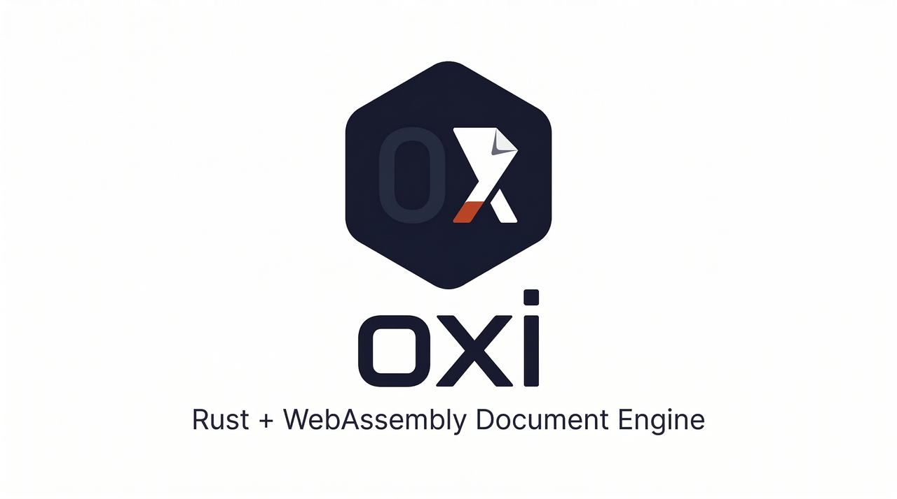

<p align="center">
  
</p>

<p align="center">
  <b>Rust + WebAssembly で作るオープンソースのドキュメント処理スイート</b><br>
  .docx / .xlsx / .pptx / PDF をブラウザ上でネイティブに表示・編集 — サーバー不要
</p>

<p align="center">
  <a href="https://ryujiyasu.github.io/oxi/"><strong>Live Demo</strong></a> ·
  <a href="docs/roadmap.md"><strong>Roadmap</strong></a> ·
  <a href="#contributing"><strong>Contributing</strong></a>
</p>

<p align="center">
  <a href="LICENSE"></a>
  
  
</p>

---

## 特徴

- **パース** — .docx, .xlsx, .pptx, PDF を言語非依存の中間表現 (IR) に変換
- **レンダリング** — レイアウトエンジンで段落・表・画像・ヘッダー/フッター・ページ罫線を描画
- **編集** — .docx / .xlsx / .pptx のテキストをラウンドトリップ編集（元の XML を保持）
- **ダウンロード** — 編集済みファイルを元の ZIP にパッチして出力（再構築なし）
- **PDF** — テキスト抽出、構造解析、PDF 生成
- **日本語組版** — 禁則処理 (JIS X 4051)、MS ゴシック / MS 明朝 / 游ゴシック フォントメトリクス
- **判子 / 印鑑** — デジタル印鑑 (丸印・角印・小判型) を SVG 生成 + PAdES PDF 電子署名
- **100% クライアントサイド** — すべて WebAssembly で処理、データはブラウザの外に出ない

> **[Live Demo](https://ryujiyasu.github.io/oxi/)** で判子プレビュー・PDF 生成・テキスト抽出をすぐに試せます

## アーキテクチャ

```
crates/
  oxi-common/         共通 OOXML ユーティリティ (ZIP, XML, relationships)
  oxidocs-core/       .docx エンジン — パーサー, IR, レイアウト, フォントメトリクス, エディタ
  oxicells-core/      .xlsx エンジン — パーサー, IR, エディタ
  oxislides-core/     .pptx エンジン — パーサー, IR, エディタ
  oxipdf-core/        PDF 1.7 エンジン — パーサー, テキスト抽出, 生成
  oxihanko/           デジタル印鑑 (判子) 生成 + PAdES 署名
  oxi-wasm/           WebAssembly バインディング (wasm-bindgen)
web/                  Web デモ (vanilla JS + Canvas)
tools/
  font-metrics-gen/   システムフォントからメトリクスを抽出するツール
  metrics/            行高さ分析スクリプト・データ
tests/fixtures/       テスト用 .docx / .xlsx / .pptx ファイル
```

### IR 設計

中間表現は言語非依存で、Word/Excel/PowerPoint の内部構造に依存しない:

```
Document → Page → Block (Paragraph | Table | Image) → Run
```

### ラウンドトリップ編集

元の ZIP アーカイブを保持し、変更のあった XML テキストノードだけをパッチ:

| フォーマット | 座標系 | パッチ対象 |
|------------|--------|-----------|
| .docx | (段落, ラン) | `<w:t>` テキストノード |
| .xlsx | (シート, 行, 列) | `<c>` セル値 (inline string) |
| .pptx | (スライド, シェイプ, 段落, ラン) | `<a:t>` テキストノード |

### WASM API

すべての処理が `wasm-bindgen` 経由で JavaScript から直接呼び出し可能:

```js
import init, {
  // ドキュメント
  parse_document,        // .docx → IR (JSON)
  parse_spreadsheet,     // .xlsx → IR (JSON)
  parse_presentation,    // .pptx → IR (JSON)
  layout_document,       // .docx → 座標付きレイアウト
  // 編集
  edit_docx,             // テキスト編集 → 新しい .docx バイト列
  edit_xlsx,             // セル編集 → 新しい .xlsx バイト列
  edit_pptx,             // スライド編集 → 新しい .pptx バイト列
  create_blank_docx,     // 空の .docx を生成
  // PDF
  parse_pdf,             // PDF → 構造 (JSON)
  pdf_extract_text,      // PDF → プレーンテキスト
  create_pdf,            // PDF を新規生成
  pdf_verify_signatures, // PDF 署名検証
  // 判子 (Hanko)
  generate_hanko_svg,    // カスタム設定で判子 SVG 生成
  preview_hanko,         // 名前だけで判子プレビュー
} from "./oxi_wasm.js";

await init();

// ドキュメント処理
const response = await fetch("sample.docx");
const bytes = new Uint8Array(await response.arrayBuffer());
const ir = parse_document(bytes);     // 言語非依存 IR (JSON)
const layout = layout_document(bytes); // Canvas 描画用の座標付き要素

// 判子プレビュー
const stamp = preview_hanko("山田");   // SVG 文字列

// PDF 生成
const pdf = create_pdf("タイトル", "本文テキスト");
```

## クイックスタート

### 前提条件

- [Rust](https://rustup.rs/) 1.93+
- [wasm-pack](https://rustwasm.github.io/wasm-pack/installer/) 0.14+

### ビルド & テスト

```bash
cargo build                          # 全クレートをビルド
cargo test                           # テスト実行
cargo clippy                         # Lint
```

### Wasm ビルド & デモ起動

```bash
cd crates/oxi-wasm
wasm-pack build --target web         # .wasm + JS バインディングをビルド

cd ../../web
python3 -m http.server 8080          # http://localhost:8080 で起動
```

## 技術スタック

| レイヤー | 技術 |
|---------|------|
| コアエンジン | Rust (メモリ安全、ゼロコスト抽象化) |
| XML パース | `quick-xml` |
| ZIP 処理 | `zip` クレート |
| シリアライゼーション | `serde` / `serde_json` |
| ブラウザバインディング | `wasm-bindgen` + `wasm-pack` |
| フォントメトリクス | Windows システムフォントから事前計算 (13 フォント, ~55 KB JSON) |
| Web デモ | Vanilla JS + Canvas (フレームワーク依存なし) |

## 日本語組版

JIS X 4051 に基づく禁則処理を実装:

- **行頭禁則** — 閉じ括弧、句読点、拗促音 (。、）〕ぁぃぅ…)
- **行末禁則** — 開き括弧 (（〔［｛…)
- **フォントメトリクス** — MS ゴシック, MS 明朝, 游ゴシック, 游明朝 (win ascent/descent 対応)
- **行高さ計算** — `max(winAsc + winDes, hheaAsc + hheaDes + hheaGap) / UPM × fontSize`
- **文書グリッド** — `ceil(height / pitch) × pitch` によるグリッドスナップ

## 判子 (Hanko) — デジタル印鑑

`oxihanko` クレートで日本のビジネスに必須の印鑑を完全デジタル化:

| スタイル | 用途 | 例 |
|---------|------|-----|
| **丸印** (Round) | 個人印・認印 | 名前 2 文字 → 横書き、3 文字以上 → 縦書き |
| **角印** (Square) | 会社印・法人印 | 4 文字以下は 2×2 グリッド (右→左の伝統配置) |
| **小判型** (Oval) | 銀行届出印 | 楕円スタイル |
| **承認印** | 日付入り承認スタンプ | 名前 + 日付 + 区切り線 |

**主な機能:**
- SVG 出力 — 高解像度でスケーラブル
- インク色: 朱色 (vermilion)・赤・黒・カスタム RGB
- PDF 署名と連携 — 可視スタンプ付き PAdES 電子署名
- WASM 経由でブラウザから直接生成

```js
// ブラウザで判子をリアルタイムプレビュー
const svg = preview_hanko("山田");
document.getElementById("stamp").innerHTML = svg;

// カスタム設定で生成
const svg = generate_hanko_svg({
  name: "株式会社",
  style: "Square",
  color: { r: 227, g: 66, b: 52 },
  size: 120
});
```

**[Live Demo](https://ryujiyasu.github.io/oxi/)** → ファイルを開かずに「Hanko」タブで判子をすぐに試せます。

## PDF エンジン

`oxipdf-core` クレートで PDF 1.7 をフルサポート:

| 機能 | 説明 |
|------|------|
| **パース** | PDF 構造解析 (xref, オブジェクト, コンテンツストリーム, CMap) |
| **テキスト抽出** | ページ単位・ドキュメント全体のプレーンテキスト取得 |
| **PDF 生成** | A4 ページにテキスト配置、メタデータ付き PDF を新規作成 |
| **電子署名** | PAdES / PKCS#7 準拠の署名 & 検証 |
| **判子署名** | `oxihanko` と連携し、可視印鑑付きで署名 |

```js
// PDF からテキスト抽出
const text = pdf_extract_text(pdfBytes);

// PDF を新規生成
const pdfBytes = create_pdf("レポート", "Hello, World!");

// 署名を検証
const signatures = pdf_verify_signatures(pdfBytes);
```

署名プロバイダーはプラグイン設計 (`SignatureProvider` trait) で、将来的にマイナンバーカード (JPKI) 等にも拡張可能。

## ゴールデンテスト — 504 ファイル 100% パース成功

官公庁 (経産省, 財務省, 国税庁, 統計局, デジタル庁 等) + 生成ファイルの計 504 ファイルでパース成功率をテスト:

| | Oxi パース成功率 | ファイル数 |
|---|---|---|
| **全体** | **100.0%** | **504** |
| DOCX | 100.0% | 147 |
| XLSX | 100.0% | 285 |
| PPTX | 100.0% | 72 |

### Oxi vs LibreOffice 比較

同じ 504 ファイルを LibreOffice (headless PDF 変換) でもテスト:

| | Oxi | LibreOffice |
|---|---|---|
| **全体** | **100.0%** | 99.2% |
| DOCX | 100.0% | 100.0% |
| XLSX | **100.0%** | 98.6% |
| PPTX | 100.0% | 100.0% |

> LibreOffice は大規模な政府統計 xlsx ファイル 4 件でタイムアウト (45 秒超)。Oxi はすべて即座にパース成功。

> **テスト内容**: 各ファイルをパースして IR (中間表現) に変換。エラーなしで完了すれば成功。
> SmartArt, 数式 (OMML), OLE オブジェクト, マクロを含むファイルもグレースフルに処理。

テストツール: [`tools/golden-test/`](tools/golden-test/) — ドキュメント収集スクリプト + Rust テストハーネス

```bash
# ドキュメント収集
cd tools/golden-test
python collect_documents.py --target 1000

# パース成功率テスト
cargo build --release
./target/release/golden-test ./documents
```

## ロードマップ

### v1 — 基盤 (現在)
- [x] .docx / .xlsx / .pptx パーサー & 言語非依存 IR
- [x] レイアウトエンジン (段落, 表, 画像, ヘッダー/フッター, ページ罫線)
- [x] 日本語組版 (禁則処理)
- [x] 3フォーマットのラウンドトリップ編集
- [x] PDF パース, テキスト抽出, 生成
- [x] 判子生成 + PAdES 電子署名
- [x] Wasm ビルド + Web デモ
- [ ] 高度なフォントメトリクス & 均等割り付け (.docx)
- [ ] 数式評価 / セル結合 / チャート (.xlsx)
- [ ] スライドマスター / トランジション / アニメーション (.pptx)
- [ ] 縦書き & ルビ (振り仮名)

### v2 — コラボレーション
- CRDT (yrs) によるリアルタイム共同編集
- AI アシスト
- エンドツーエンド暗号化
- PWA / オフライン対応

### v3 — プラットフォーム
- プラグインシステム
- デスクトップ & モバイルアプリ (Tauri)
- ワークフロー自動化
- SaaS 提供

### v4 — エンタープライズ
- コンプライアンス & 監査証跡
- 業界特化 (法務, 医療, 行政)
- 開発者エコシステム & マーケットプレイス

詳細は [docs/roadmap.md](docs/roadmap.md) を参照。

## なぜ Rust + Wasm？

- **パフォーマンス** — ブラウザ上でネイティブ速度のドキュメント処理
- **メモリ安全** — バッファオーバーフロー、use-after-free、データ競合なし
- **小さなバイナリ** — スイート全体で `.wasm` は約 1.4 MB
- **サーバーコストゼロ** — すべてクライアントサイド処理、バックエンド不要
- **プライバシー** — ドキュメントはユーザーのデバイスから一切外に出ない

## Contributing

コントリビューション歓迎です！

1. リポジトリをフォーク
2. フィーチャーブランチを作成 (`git checkout -b feature/amazing-feature`)
3. テストと Lint を実行 (`cargo test && cargo clippy`)
4. プルリクエストを送信

## License

[MIT](LICENSE)

---

<details>
<summary><strong>English</strong></summary>

## Features

- **Parse** .docx, .xlsx, .pptx, PDF into a language-agnostic IR
- **Render** documents with a layout engine (paragraphs, tables, images, headers/footers, page borders)
- **Edit** text in .docx / .xlsx / .pptx with round-trip fidelity — original XML is preserved
- **Download** edited files — changes are patched into the original ZIP, not rebuilt from scratch
- **PDF** text extraction, structure parsing, and PDF generation from scratch
- **Japanese typography** — kinsoku shori (JIS X 4051), MS Gothic / MS Mincho / Yu Gothic font metrics
- **Hanko / Inkan** — Japanese digital stamp generation (round, square, oval) + PAdES PDF signatures
- **100% client-side** — all processing runs in WebAssembly, nothing leaves your browser

> Try hanko preview, PDF generation, and text extraction in the **[Live Demo](https://ryujiyasu.github.io/oxi/)**

## Architecture

```
crates/
  oxi-common/         Shared OOXML utilities (ZIP, XML, relationships)
  oxidocs-core/       .docx engine — parser, IR, layout, font metrics, editor
  oxicells-core/      .xlsx engine — parser, IR, editor
  oxislides-core/     .pptx engine — parser, IR, editor
  oxipdf-core/        PDF 1.7 engine — parser, text extraction, generator
  oxihanko/           Japanese digital stamp (hanko) generator + PAdES signer
  oxi-wasm/           WebAssembly bindings (wasm-bindgen)
web/                  Web demo (vanilla JS + Canvas)
tools/
  font-metrics-gen/   Standalone tool to extract font metrics from system fonts
  metrics/            Line-height analysis scripts and data
tests/fixtures/       Test .docx / .xlsx / .pptx files
```

### IR design

The Intermediate Representation is language-agnostic and does not depend on Word/Excel/PowerPoint internals:

```
Document → Page → Block (Paragraph | Table | Image) → Run
```

### Round-trip editing

Original ZIP archives are preserved. Only the specific XML text nodes that changed are patched:

| Format | Coordinate system | Patched element |
|--------|------------------|----------------|
| .docx | (paragraph, run) | `<w:t>` text nodes |
| .xlsx | (sheet, row, col) | `<c>` cell values (inline string) |
| .pptx | (slide, shape, paragraph, run) | `<a:t>` text nodes |

### WASM API

All processing is exposed via `wasm-bindgen` and can be called directly from JavaScript:

```js
import init, {
  // Documents
  parse_document,        // .docx → IR (JSON)
  parse_spreadsheet,     // .xlsx → IR (JSON)
  parse_presentation,    // .pptx → IR (JSON)
  layout_document,       // .docx → positioned layout with coordinates
  // Editing
  edit_docx,             // apply text edits → new .docx bytes
  edit_xlsx,             // apply cell edits → new .xlsx bytes
  edit_pptx,             // apply slide edits → new .pptx bytes
  create_blank_docx,     // generate empty .docx
  // PDF
  parse_pdf,             // PDF → structure (JSON)
  pdf_extract_text,      // PDF → plain text
  create_pdf,            // generate PDF from scratch
  pdf_verify_signatures, // verify PDF signatures
  // Hanko (Japanese stamps)
  generate_hanko_svg,    // generate stamp SVG with custom config
  preview_hanko,         // quick stamp preview by name
} from "./oxi_wasm.js";

await init();

// Document processing
const response = await fetch("sample.docx");
const bytes = new Uint8Array(await response.arrayBuffer());
const ir = parse_document(bytes);     // language-agnostic IR as JSON
const layout = layout_document(bytes); // positioned elements for canvas rendering

// Hanko stamp preview
const stamp = preview_hanko("山田");   // SVG string

// PDF generation
const pdf = create_pdf("Report", "Hello, World!");
```

## Quick Start

### Prerequisites

- [Rust](https://rustup.rs/) 1.93+
- [wasm-pack](https://rustwasm.github.io/wasm-pack/installer/) 0.14+

### Build & test

```bash
cargo build                          # Build all crates
cargo test                           # Run tests
cargo clippy                         # Lint
```

### Build Wasm & run demo

```bash
cd crates/oxi-wasm
wasm-pack build --target web         # Build .wasm + JS bindings

cd ../../web
python3 -m http.server 8080          # Serve at http://localhost:8080
```

## Tech Stack

| Layer | Technology |
|-------|-----------|
| Core engines | Rust (memory-safe, zero-cost abstractions) |
| XML parsing | `quick-xml` |
| ZIP handling | `zip` crate |
| Serialization | `serde` / `serde_json` |
| Browser bindings | `wasm-bindgen` + `wasm-pack` |
| Font metrics | Pre-computed from Windows system fonts (13 fonts, ~55 KB JSON) |
| Web demo | Vanilla JS + Canvas (no framework dependencies) |

## Hanko — Digital Japanese Stamps

The `oxihanko` crate digitizes Japan's essential business seals:

| Style | Use case | Layout |
|-------|----------|--------|
| **Round** (丸印) | Personal seal | 1-2 chars → horizontal, 3+ chars → vertical |
| **Square** (角印) | Company seal | ≤4 chars in 2×2 grid (right-to-left traditional order) |
| **Oval** (小判型) | Bank registration | Ellipse style |
| **Approval** | Date stamp | Name + date + divider lines |

- SVG output — scalable and high-resolution
- Ink colors: vermilion, red, black, or custom RGB
- Integrates with PDF signing — visible stamp embedded in PAdES signature
- Available via WASM — generate stamps directly in the browser

```js
const svg = preview_hanko("山田");                    // quick preview
const svg = generate_hanko_svg({                      // custom config
  name: "株式会社", style: "Square",
  color: { r: 227, g: 66, b: 52 }, size: 120
});
```

## PDF Engine

The `oxipdf-core` crate provides full PDF 1.7 support:

| Feature | Description |
|---------|-------------|
| **Parse** | PDF structure analysis (xref, objects, content streams, CMap) |
| **Text extraction** | Per-page and whole-document plain text |
| **Generation** | Create new PDFs with text content and metadata |
| **Digital signatures** | PAdES / PKCS#7 signing and verification |
| **Hanko signing** | Visible stamp appearance via `oxihanko` integration |

Signature providers use a plugin design (`SignatureProvider` trait), extensible to support hardware tokens like Japan's My Number Card (JPKI) in the future.

## Why Rust + Wasm?

- **Performance** — native-speed document parsing and layout in the browser
- **Memory safety** — no buffer overflows, no use-after-free, no data races
- **Small binary** — the compiled `.wasm` is ~1.4 MB for the entire suite
- **Zero server cost** — all processing runs client-side, no backend infrastructure needed
- **Privacy** — documents never leave the user's device

</details>
