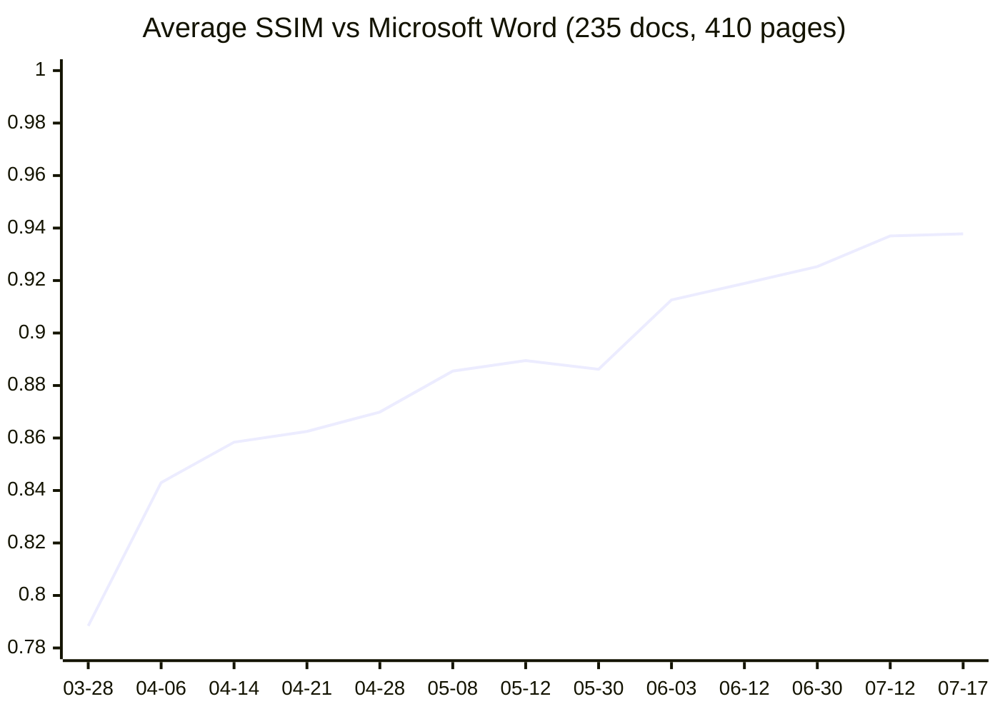
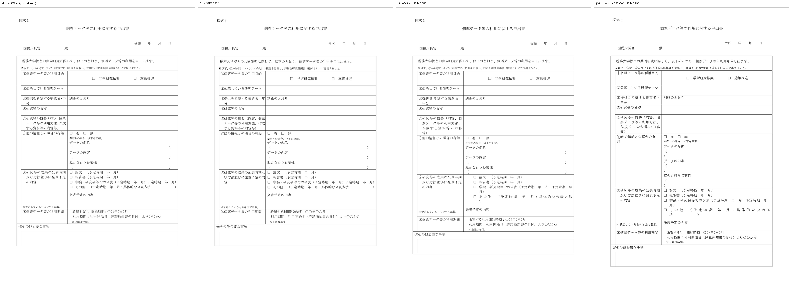

# Oxi

**Oxi = Opensource Xplatform Interoperability**

A browser-native .docx rendering engine — Rust + WebAssembly, no server.
Its layout is measured against Microsoft Word, page by page, with pixel-level SSIM.

[Live Demo](https://ryujiyasu.gitlab.io/oxi/) · [Cross-Renderer Comparison](#cross-renderer-comparison) · [Contributing](#contributing)

  

> **Canonical repository:** [GitLab — Ryujiyasu/oxi](https://gitlab.com/Ryujiyasu/oxi) (issues, merge requests, CI).
> The [GitHub repository](https://github.com/Ryujiyasu/oxi) is a mirror kept in sync with GitLab `main`.

---

## Why Now

Europe is actively dismantling its Microsoft Office dependency in 2026:

- **France** — DINUM directive (2026-04-08) mandates that 2.5M public-sector PCs migrate to free-software stacks by 2027; each ministry submits a roadmap by autumn 2026; Microsoft Teams and Zoom are already blocked on the inter-ministerial network (RIE). 20 years of Gendarmerie Nationale GendBuntu (97% of 103,164 PCs migrated) is the reference model.
- **Switzerland** — The Federal Chancellery (Bundeskanzlei) officially announced (2026-04-18) a phased, long-term reduction of Microsoft 365 dependency. The BOSS (Büroautomation durch Einsatz von Open-Source-Software) feasibility study delivers mid-2026. Germany's ZenDiS OpenDesk is the named reference implementation.
- **Germany** — ZenDiS OpenDesk is already in production at Schleswig-Holstein, Thüringen, Baden-Württemberg, and — after US sanctions blocked Microsoft access earlier this year — the International Criminal Court.

Every one of these transitions is missing the same piece: **a rendering engine that opens existing .docx files identically to Microsoft Word**, so that "migration" stops being a project and becomes indistinguishable from switching applications. LibreOffice's 20-year struggle in public-sector rollouts is well-documented — not because its features are weak, but because per-document visual divergence forces every organization into a per-file audit it cannot staff.

Oxi's Ra loop is a mechanical convergence toward SSIM = 1.0 against Microsoft Word. Not a better migration tool — the dissolution of the migration problem.

---

## Layout Accuracy vs Microsoft Word

Oxi's layout engine is measured against Microsoft Word using pixel-level SSIM across 235 real-world .docx documents (410 pages). All specifications are derived from COM API black-box measurements — no DLL disassembly, no speculation.



> The small step at **05-30** is not a regression: the SSIM baseline was
> recomputed from scratch that day, so points before and after sit on
> slightly different measurement bases. The line is a per-page mean;
> the current (2026-07-17) figures are per-page mean **0.9378** (std 0.0625)
> and per-doc mean **0.9591** (std 0.0434) over the 235-document Japanese
> corpus.

Two things make this number trustworthy rather than asserted:

- **Every document clears a floor, not just the average.** As of 2026-07-17 the worst-scoring document in the whole corpus sits at **SSIM 0.80** — across all 235 Japanese documents *and* 6 English documents, none renders below 0.80 structural similarity to Word. A per-document floor is a stronger guarantee than a mean: it says *whichever* file you open, this is the least fidelity you get. The spread is tight around a high mean — Japanese per-document **mean 0.959, standard deviation 0.043** (212 of 235 documents score ≥ 0.90); English per-document **mean 0.853, standard deviation 0.029**. The floor (Japanese 0.802, English 0.822) is a genuine tail, not a broad shortfall.
- **Pagination is exact.** Every paragraph of every corpus document lands on the same page as Microsoft Word (per-paragraph page match: **87/87 documents = 100%**, reached 2026-07-03, measured via Word COM). SSIM measures how a page looks; pagination measures whether it *is the same page*. A renderer can look plausible while shifting content across pages — the two metrics together close that gap.
- **The gate is external, and it changed whenever it went blind.** Every score is against Microsoft Word's own render — never against Oxi's previous output. And when a measure plateaued because it structurally could not see the remaining error, the merge gate moved to one that could. The date-by-date progress table is in [docs/layout_accuracy.md](docs/layout_accuracy.md); the derivation log is [RESEARCH_LOG.md](RESEARCH_LOG.md).

### Cross-Renderer Comparison

The same SSIM pipeline scores third-party engines on identical inputs: each engine renders every corpus page, and every render is compared against **Microsoft Word's own render of that page** (150 DPI, resize-to-match, structural similarity). Word is the ground truth; nobody grades their own homework.



*The same government research-application form (rotated table-cell labels, 459f05), rendered by Word, Oxi, LibreOffice, and @silurus/ooxml. Word and Oxi are near-indistinguishable (SSIM 0.904); LibreOffice wraps some cell labels, so rows start to inflate (0.855); silurus wraps the most, and the whole form drifts (0.791).*

| Engine | mean SSIM vs Word (per page) | pages where best |
|--------|------------------------------|------------------|
| **Oxi** (2026-07-17 build) | **0.9377** | **188** / 406 |
| ONLYOFFICE (x2t headless → PDF) | 0.8913 | 134 / 406 |
| LibreOffice (soffice headless → PDF) | 0.8872 | 84 / 406 |

Corpus: the 235-document / 410-page Japanese business-document baseline (regulations, government forms, contracts). LibreOffice and ONLYOFFICE page scores were rendered 2026-05-31 (both engines are deterministic; their output for these files does not change); the Oxi column is the current build. On 111 pages both third-party engines still beat Oxi — exactly those pages feed the bug-finder loop ("everyone matches Word except Oxi" = a guaranteed-fixable bug), so this table is a work queue, not just a scoreboard.

Against **@silurus/ooxml** (the closest architectural neighbor — also Rust/WASM + canvas, driven headlessly via Playwright): on an 8-document Japanese **vertical-writing** subset (30 paired pages, same Word ground truth; silurus built from source at `797a3efab0da`, 2026-07-13, including its newest vertical-glyph work) — **Oxi 0.861 / LibreOffice 0.785 / silurus 0.755**, Oxi ahead of silurus on 29/30 pages. (LibreOffice's 0.785 here vs 0.887 on the full baseline above is a different corpus, not a contradiction: every engine scores lower on this subset — Oxi included, 0.861 vs 0.937 — because vertical writing is where all engines lose the most.) silurus's recent real-`vert`-glyph rendering (long marks, dashes) is visually correct, but it does not close the distance to Word: glyph orientation and Word fidelity are different problems, and the difference is the measurement loop, not the tech stack. silurus also mis-paginates the corpus (101 pages vs Word's 94 on a split-table document; 18 vs 16 on an index document; 2 vs 1 on a single-page form).

English is no longer a blanket counterpoint, but it is not closed either. On the 6-document **English** corpus (UK/US government forms and contracts, opened 2026-07-08) Oxi now leads: per-doc **Oxi 0.853 vs LibreOffice 0.789** (2026-07-17; Oxi ahead on 5 of 6 documents), and all 6 documents reached **100% paragraph-page pagination match** on 2026-07-14 — the "closing week by week" prediction landed. The honest counterpoint has moved to the wild: on a broader 50-document English benchmark sampled from the public docx-corpus (5 per document type, frozen selection rule, same Word ground truth) LibreOffice is still ahead — per-doc **Oxi 0.824 vs LibreOffice 0.853**, LibreOffice best on 32 of 49 pairs — and 41 of those 50 documents already match Word's pagination. That gap is the current English work queue.

Reproduce: `tools/metrics/compare_renderers_3way.py` (Libra/OO), `tools/metrics/render_libra.py`, `tools/metrics/render_onlyoffice.py`, `tools/metrics/browser_oracle.py` + `tools/browser-oracle/` (silurus), `tools/metrics/ssim_now.py` (Oxi absolute re-measure), `tools/metrics/en_bench.py` (English wild-corpus benchmark).

---

## How the Fidelity Is Earned

### 100% Clean-Room Implementation

Oxi's rendering engine was built without any disassembly, decompilation, or binary analysis of proprietary software. All layout specifications come from two sources only:

1. **Published standards** — OOXML (ISO/IEC 29500 / ECMA-376), PDF (ISO 32000)
2. **Black-box testing** — observing output values via the Microsoft Office COM API

AI (Claude) was used throughout specification derivation — root-cause analysis, COM measurement, pattern confirmation, fix implementation — with every specification decision grounded in COM-measured values and confirmed by human review. Under Microsoft's [Open Specification Promise](https://learn.microsoft.com/en-us/openspecs/dev_center/ms-devcentlp/1c24c7c8-28b0-4ce1-a47d-95fe1ff504bc), no patents are asserted against implementations of the OOXML specification.

### Dual Font Engine: GDI + DirectWrite

Word's layout is built on GDI, which rounds character widths to integer pixels and computes line heights by rounding ascent and descent separately before adding them. These roundings cascade: a 0.18pt/character difference at Calibri 11pt becomes 10.8pt of accumulated error over 60 characters — enough to change where lines break and pages split. Reproducing Word therefore requires reproducing GDI exactly; for formats without a GDI heritage, it requires *not* inheriting those constraints.

| Format | Engine | Reason |
|--------|--------|--------|
| .docx (Word compatible) | **GDI** | Word uses GDI text metrics — integer-pixel rounding, tmHeight line heights, hinting-dependent widths |
| .odt / .pdf | **DirectWrite** | ODF has no single canonical engine; DirectWrite's floating-point metrics give cross-platform consistency, variable-font and modern OpenType support, without GDI's legacy rounding |

Both engines implement a shared `FontEngine` trait, so the layout engine switches with a one-line configuration change per document. No pixel accuracy is lost for Word documents; no legacy constraints limit cross-platform formats.

### Open Fonts Only

Oxi bundles no proprietary fonts. Open-licensed fonts are metric-matched to their Microsoft counterparts (advance width, line height, kerning — pixel-identical within that baseline, verified by automated tests). For documents authored with Microsoft Fonts, a **font divergence score** — a per-glyph pixel-diff table generated once on a licensed system, combined with the document's character frequency — quantifies visual fidelity without shipping proprietary fonts at runtime.

### Golden Tests — 504 Files, 100% Parse Success

Tested against 504 real-world government documents (Japanese ministries) + generated files:

|        | Oxi    | LibreOffice |
|--------|--------|-------------|
| Overall | 100.0% | 99.2% |
| DOCX   | 100.0% | 100.0% |
| XLSX   | 100.0% | 98.6% |
| PPTX   | 100.0% | 100.0% |

LibreOffice timed out (>45s) on 4 large government xlsx files. Oxi parsed all instantly.

---

## Landscape — Why Not Use ...?

| Solution | Approach | Limitation |
|----------|----------|------------|
| **LibreOffice / Collabora Online** | C++ server-side rendering | Breaks Word layouts. Requires server infrastructure. No pixel-fidelity goal |
| **ZetaOffice** | LibreOffice compiled to WASM | 100MB+ download. Layout accuracy = LibreOffice quality. Not a rewrite, just a port |
| **ONLYOFFICE** | JavaScript canvas rendering | Closest architecture to Oxi, but AGPL license. No COM-measured Word compatibility |
| **@silurus/ooxml** | Rust/WASM + canvas | Same stack as Oxi, but self-referential Canvas2D oracle — no external Word ground truth ([measured above](#cross-renderer-comparison)) |
| **Apryse (PDFTron)** | C++ → WASM viewer | Proprietary. Converts to internal format — not native OOXML rendering |
| **Google Docs** | Server-rendered | Proprietary. Requires server. Intentionally diverges from Word layout |
| **docx-rs / rdocx** | Rust DOCX libraries | Read/write and export only — no layout engine for browser rendering |

**Oxi's unique combination:** OSS (MPL-2.0 core + permissive bindings — embeddable in proprietary products, unlike AGPL) + Rust/WASM client-side + dual-format first-class (.docx + .odt, no proprietary "Oxi format") + COM-measured Word fidelity + zero server cost. No other project occupies this intersection.

The claims above are measured, not asserted — see [Cross-Renderer Comparison](#cross-renderer-comparison) for SSIM-vs-Word numbers against LibreOffice, ONLYOFFICE, and @silurus/ooxml on the same documents.

LibreOffice treats ODF as native and OOXML as an import (round-trip degrades). Microsoft Word inverts that. Oxi's IR is format-agnostic from the start — neither format owns it, so neither degrades on round-trip.

---

## Also in the Box

Beyond .docx rendering (the core mission), Oxi also ships:

- **.xlsx / .pptx / PDF** — parsing, rendering, text extraction, PDF generation
- **Round-trip editing** — edit .docx / .xlsx / .pptx; the original ZIP is preserved and only changed XML text nodes are patched, never rebuilt from scratch
- **Japanese typography** — kinsoku shori (JIS X 4051), vertical writing (tategaki), tate-chu-yoko (縦中横), ruby (furigana), warichu (割注), emphasis marks (圏点)
- **Rich formatting** — run/paragraph shading, character borders, text effects (shadow / emboss / imprint / outline), small caps, drop caps, tab leaders
- **Hanko / Inkan** — Japanese digital stamp generation (round, square, oval) + PAdES PDF signatures
- **100% client-side** — all processing runs in WebAssembly; nothing leaves your browser

These share the IR and the font engines, but they are not where Oxi's measured differentiation lives — the rendering fidelity above is.

---

## Architecture

```
crates/
  oxi-common/         Shared OOXML utilities (ZIP, XML, relationships)
  oxidocs-core/       .docx engine — parser, IR, layout, font metrics, editor
  oxicells-core/      .xlsx engine — parser, IR, editor
  oxislides-core/     .pptx engine — parser, IR, editor
  oxipdf-core/        PDF 1.7 engine — parser, text extraction, generator
  oxihanko/           Japanese digital stamp (hanko) generator + PAdES signer
  oxi-wasm/           WebAssembly bindings (wasm-bindgen)
web/                  Web demo (vanilla JS + Canvas)
tools/
  font-metrics-gen/   Standalone tool to extract font metrics from system fonts
  font-glyph-diff-gen/ Per-glyph pixel-diff table for Microsoft Font divergence scoring
  metrics/            Line-height analysis scripts and data
tests/fixtures/       Test .docx / .xlsx / .pptx files
```

### IR Design

The Intermediate Representation is language-agnostic and does not depend on Word/Excel/PowerPoint internals:

```
Document → Page → Block (Paragraph | Table | Image) → Run
```

### WASM API

All processing is exposed via wasm-bindgen and can be called directly from JavaScript:

```javascript
import init, {
  parse_document,        // .docx → IR (JSON)
  parse_spreadsheet,     // .xlsx → IR (JSON)
  parse_presentation,    // .pptx → IR (JSON)
  layout_document,       // .docx → positioned layout with coordinates
  edit_docx,             // apply text edits → new .docx bytes
  edit_xlsx,             // apply cell edits → new .xlsx bytes
  edit_pptx,             // apply slide edits → new .pptx bytes
  create_blank_docx,     // generate empty .docx
  parse_pdf,             // PDF → structure (JSON)
  pdf_extract_text,      // PDF → plain text
  create_pdf,            // generate PDF from scratch
  pdf_verify_signatures, // verify PDF signatures
  generate_hanko_svg,    // generate stamp SVG with custom config
  preview_hanko,         // quick stamp preview by name
} from "./oxi_wasm.js";

await init();
const bytes = new Uint8Array(await (await fetch("sample.docx")).arrayBuffer());
const layout = layout_document(bytes); // positioned elements for canvas rendering
```

---

## Quick Start

### Prerequisites
- Rust 1.93+
- wasm-pack 0.14+

### Build & Test

```bash
cargo build                          # Build all crates
cargo test                           # Run tests
cargo clippy                         # Lint
```

### Build Wasm & Run Demo

```bash
cd crates/oxi-wasm
wasm-pack build --target web         # Build .wasm + JS bindings

cd ../../web
python3 -m http.server 8080          # Serve at http://localhost:8080
```

---

## Tech Stack

| Layer | Technology |
|-------|------------|
| Core engines | Rust (memory-safe, zero-cost abstractions) |
| XML parsing | quick-xml |
| ZIP handling | zip crate |
| Serialization | serde / serde_json |
| Browser bindings | wasm-bindgen + wasm-pack |
| Font metrics | Generated at build time from user's local system fonts via tools/font-metrics-gen |
| Web demo | Vanilla JS + Canvas (no framework dependencies) |

---

## Security & Hardening

Oxi treats every document as untrusted input. A hostile file can render wrong — it cannot run code, exfiltrate data, or escape the sandbox. See [SECURITY.md](SECURITY.md) for the reporting policy.

- **Zero `unsafe`** in the WASM-facing crates (`oxi-common`, `oxidocs-core`, `oxicells-core`, `oxislides-core`, `oxipdf-core`, `oxihanko`, `oxi-wasm`) — memory safety end-to-end in the engine; platform `unsafe` exists only in the optional native GDI/DirectWrite verification renderers
- **No active content, ever** — macros (`vbaProject.bin`), OLE objects, and embedded scripts are never executed; they are preserved as opaque bytes for round-trip. Field codes are never evaluated (only `PAGE`/`NUMPAGES` are computed, from the engine's own layout state)
- **XXE-immune by design** — streaming XML via `quick-xml`; external entities and DTDs are never fetched or expanded
- **No network I/O** — parsing and layout make zero network requests; in the browser everything stays inside the WASM sandbox
- **Inert embedded fonts** — document-embedded fonts are never loaded or rasterized; text metrics come from pre-computed tables shipped with the engine

**Quality gates** — every layout change must pass, in order: the real-Word pagination oracle (per-paragraph page match on the 87-document corpus, measured via Word COM — currently **87/87 = 100%**), the SSIM regression sentinel (238 documents pixel-compared against Word renders), an adversarial probe harness (74 synthetic documents stressing under-tested layout paths, each gated against real Word ground truth), a feature-injection perturbation harness (~40 OOXML features pixel-verified), and the unit/integration test suite. Cross-renderer verification against LibreOffice and other independent engines flags "everyone-matches-Word-except-Oxi" pages as guaranteed-fixable bugs.

---

## Roadmap

- **v1 — Foundation (current):** Word-compatible .docx rendering — pagination 87/87 = 100%, SSIM convergence via the Ra loop; .xlsx/.pptx/PDF parsing and basic rendering; round-trip editing; WASM + Canvas editor
- **v1.x — Word parity:** close the remaining per-page SSIM gap (0.938 → 0.99+); English corpus to parity; IME (Japanese/CJK input) and editor polish; .xlsx/.pptx layout engines
- **v2 — Format parity:** .odt rendering via DirectWrite, measured against a deterministic reference renderer with the same externally-gated loop; bidirectional .docx ↔ .odt at the IR level; round-trip preservation tests

The measurement loop (deterministic reference output, falsifiable hypotheses, external merge gate) transfers to ODF once the v2 baseline lands — only the reference renderer changes.

---

## Contributing

Contributions are welcome. Oxi has a simple acceptance criterion:

**Every merged PR must improve the pixel accuracy of at least one document.**

### What belongs in core
1. Pixel accuracy improvements to existing layout engine
2. New test documents with low pixel accuracy (must use OpenFont, improvement tracked via Issue)
3. New OpenFont additions (Microsoft Font metric parity verification required)
4. Format engine additions: .xlsx layout, .pptx layout, vertical writing, etc.

### What belongs elsewhere
Features that go beyond pixel-accurate rendering — collaboration, AI integration, desktop apps, purpose-specific workflows — belong in a separate extension or downstream project, not in Oxi core.

### How to contribute
1. Fork the repository
2. Create a feature branch (`git checkout -b feature/amazing-feature`)
3. Run tests and lint (`cargo test && cargo clippy`)
4. Sign off your commits (`git commit -s`) — Oxi uses the [Developer Certificate of Origin](https://developercertificate.org/) (DCO). No CLA, no copyright assignment: your code stays yours
5. Submit a pull request with pixel accuracy results

See [CONTRIBUTING.md](CONTRIBUTING.md) for details.

---

## Why Rust + Wasm?

- **Performance** — native-speed document parsing and layout in the browser
- **Memory safety** — no buffer overflows, no use-after-free, no data races
- **Small binary** — the compiled .wasm is ~1.4 MB for the entire suite
- **Zero server cost** — all processing runs client-side, no backend needed
- **Privacy** — documents never leave the user's device

---

## License

Oxi is licensed in three layers, chosen to maximize both adoption and the flow of improvements back into the canonical tree:

| Layer | License | Why |
|-------|---------|-----|
| **Core engine** (`oxi-common`, `oxidocs-core`, `oxicells-core`, `oxislides-core`, `oxipdf-core`, `oxihanko`, `oxi-cli`, `oxi-desktop`) | [MPL-2.0](LICENSE) | File-level copyleft: modifications to engine files must be published, so layout-fidelity improvements converge into one tree. Embedding Oxi in proprietary or commercial products is fully permitted — only changes to Oxi's own files must be shared. Same license as LibreOffice and Firefox |
| **Bindings** (`oxi-wasm`, `oxidocs-python`) | MIT OR Apache-2.0 | Standard Rust dual license — zero friction for embedding in any stack |
| **Conformance corpus** (self-authored repro documents under `tools/golden-test/repros/`) | CC BY-SA 4.0 | The Word-compatibility test suite is a shared public asset; improvements to it must stay shared |

Contributions are accepted under the [Developer Certificate of Origin](https://developercertificate.org/) (`git commit -s`). There is no CLA — contributors keep their copyright, and the project cannot relicense your work out from under you.

All third-party dependencies must be MPL-2.0-compatible (MIT, Apache-2.0, BSD, etc.).
