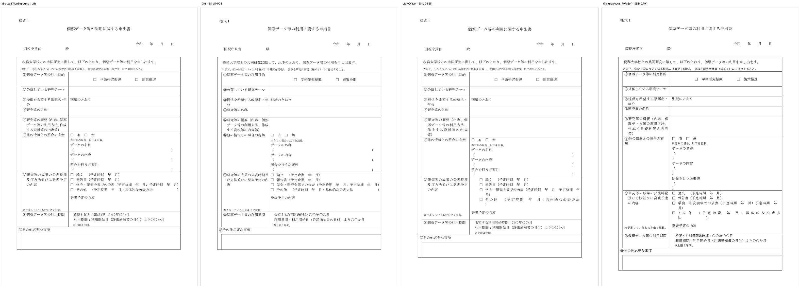

# Oxi

**Oxi = Opensource Xplatform Interoperability**

A browser-native Office document engine — Rust + WebAssembly, no server.
Word (.docx) layout is scored against Microsoft Word page by page, PowerPoint (.pptx) against PowerPoint slide by slide, on **frozen blind benchmarks of documents the engine has never been tuned against** — and Excel (.xlsx) ships a formula engine and a browser VBA host verified against Excel itself.

[Live Demo](https://ryujiyasu.gitlab.io/oxi/docs.html) · [Layout Accuracy](#layout-accuracy-vs-microsoft-word) · [Contributing](#contributing)

   

> **Canonical repository:** [GitLab — Ryujiyasu/oxi](https://gitlab.com/Ryujiyasu/oxi) (issues, merge requests, CI).
> The [GitHub repository](https://github.com/Ryujiyasu/oxi) is a mirror kept in sync with GitLab `main`.

---

## Why Now

Europe is actively dismantling its Microsoft Office dependency in 2026:

- **France** — the DINUM directive (2026-04-08) puts 2.5M public-sector PCs on a free-software path by 2027; each ministry files a roadmap in autumn 2026.
- **Switzerland** — the Federal Chancellery announced (2026-04-18) a phased reduction of Microsoft 365 dependency; the BOSS feasibility study lands mid-2026.
- **Germany** — ZenDiS OpenDesk is in production at Schleswig-Holstein, Thüringen, Baden-Württemberg, and the International Criminal Court.

Every one of these transitions is missing the same piece: **a rendering engine that opens existing .docx files identically to Microsoft Word**, so that "migration" stops being a project and becomes indistinguishable from switching applications. LibreOffice's long struggle in public-sector rollouts is well documented — not because its features are weak, but because per-document visual divergence forces every organization into a per-file audit it cannot staff.

Oxi's answer is a measurement loop, not a promise: Word is the ground truth, the gate is external, and the headline numbers come from documents the engine has never been allowed to fix.

---

## Layout Accuracy vs Microsoft Word

### How the corpora are split

An accuracy number is only as honest as the corpus it comes from. Oxi's documents are split into three roles, per language, and only one of them is allowed to be a headline:

| Role | What it is | May be a fix target? |
|------|------------|----------------------|
| **dev** | The tuned corpus: 96 documents under per-paragraph pagination gates + a 369-document (1113-page) pixel-SSIM sentinel + synthetic probes, plus every blind set retired by rotation | Yes — this is where bugs are root-caused |
| **validation** | Previously blind sets, demoted after rotation | Yes, after demotion |
| **blind** | 50 documents per language, **frozen before measurement, never anatomized**; re-measured per binary revision, not tuned against | **No** |

The blind sets are drawn from the public [superdoc-dev/docx-corpus](https://docxcorp.us/) (ODC-BY, 736K real .docx from Common Crawl) by a deterministic rule declared *before* fetching: 10 document types × the next 5 documents in SHA-256-ascending manifest order, with a purely mechanical quarantine (valid zip, has `word/document.xml`, no macros, ≤ 4 MB). No quality-based selection, no post-hoc swaps. When a newer blind set is frozen, the old one is demoted to validation and only then becomes fixable.

Everything below is measured against **Microsoft Word's own render** of the same file (Microsoft 365 16.0.20131.20154, 150 DPI, resize-to-match, structural similarity). Nobody grades their own homework.

One measurement note, because it would otherwise flatter a competitor: **OfficeCLI is measured with `--render html`, its own layout engine.** Its default `--render auto` is documented as "native on Windows w/ Word", and on a host with Word installed that path hands the rendering to Word itself — 0.996 SSIM against Word, because it *is* Word. Its own engine scores 0.972 on that same page. Only the second is a comparison.

### English blind set — blind-C50, 50 never-seen documents

Frozen 2026-07-29 as manifest ranks 21-25 per type, **before** any measurement; this is its first pixel measurement (2026-08-31). All eight engines render the same 48 documents (Microsoft Word itself fails to export 2 of the 50, so they are outside every engine's denominator).

| Engine | mean SSIM (common pages) | penalized | page count matches Word |
|--------|--------------------------|-----------|-------------------------|
| ONLYOFFICE 9.3.1.8 | **0.908** | 0.903 | 42 / 48 |
| **Oxi** | 0.903 | **0.903** | **48 / 48** |
| LibreOffice 26.2.1.2 | 0.892 | 0.881 | 43 / 48 |
| SILURUS @silurus/ooxml 0.83.1 | 0.791 | 0.741 | 35 / 48 |
| eigenpal @eigenpal/docx-editor-react 1.9.0 | 0.768 | 0.723 | 35 / 48 |
| BetterOffice @betteroffice/docx 0.1.0 | 0.761 | 0.619 | 26 / 48 |
| OfficeCLI 1.0.145 | 0.753 | 0.486 | 17 / 48 |
| GenOffice v0.1.0 | 0.740 | 0.570 | 17 / 48 |

**Oxi is the only engine that reproduces Word's pagination on every document — 48 of 48**, against ONLYOFFICE's 42 and LibreOffice's 43. `penalized` divides by `max(word_pages, engine_pages)`, so an engine that drops or invents pages is charged for it; Oxi is the only engine whose two columns are identical, because it never misses a page count. On within-page pixels ONLYOFFICE is ahead by 0.005 and LibreOffice is a near-tie (Oxi ahead on 25 of 48). The gap to the four browser/CLI engines is large in `penalized` precisely because their pagination diverges.

### Japanese blind set — blind-C50, 50 never-seen documents

Frozen 2026-08-31 as manifest ranks 16-20 per type, **before** any measurement, when the previous Japanese blind set was rotated into the development corpus. First measurement, same day, same binary.

| Engine | mean SSIM (common pages) | penalized | page count matches Word |
|--------|--------------------------|-----------|-------------------------|
| **Oxi** | **0.802** | **0.733** | 35 / 50 |
| SILURUS @silurus/ooxml 0.83.1 | 0.790 | 0.667 | 32 / 50 |
| LibreOffice 26.2.1.2 | 0.788 | 0.694 | 33 / 50 |
| OfficeCLI 1.0.145 | 0.748 | 0.509 | 22 / 50 |
| ONLYOFFICE 9.3.1.8 | 0.743 | 0.693 | **40 / 50** |
| GenOffice v0.1.0 | 0.732 | 0.500 | 10 / 50 |
| eigenpal @eigenpal/docx-editor-react 1.9.0 | 0.705 | 0.637 | 35 / 50 |
| BetterOffice @betteroffice/docx 0.1.0 | — | — | did not complete |

Oxi leads on pixels, but by 0.012-0.015 over SILURUS and LibreOffice — a modest margin on 50 documents, not a decisive one. ONLYOFFICE places page breaks better here (40 / 50 against Oxi's 35) while scoring lower on pixels: the two properties are separable and Oxi does not lead on both. **Engine rankings do not transfer between languages** — ONLYOFFICE is first in English and fifth in Japanese; SILURUS is fourth in English and second in Japanese — which is the entire reason for keeping a blind set per language.

*BetterOffice: the English pass completed in 552s, but the Japanese pass produced no output at all — its browser and dev server start, then the first document never returns. Recorded as incomplete rather than guessed at.*

### How much does one blind set decide?

Two independently frozen Japanese blind sets were measured on the **same day, same binary, same procedure**:

| Japanese blind set | Oxi mean SSIM | page count matches Word |
|--------------------|---------------|-------------------------|
| blind-B50 (ranks 11-15) | 0.842 | 45 / 50 |
| blind-C50 (ranks 16-20) | 0.802 | 35 / 50 |

The 0.040 spread is set difficulty, not engine change. Roughly a quarter of it is attributable to a known defect — 19 of the 50 blind-C documents contain an anchored floating text box whose text Oxi currently drops, and those documents average 0.06-0.10 lower than the rest — but the remainder is simply that one sample of fifty wild documents is harder than another. **A single blind number carries about ±0.02, and a page-count rate can move 90% → 70% between samples.** Quote it accordingly; the 100-document combination is Oxi 0.822, 80 / 100.

Two honest caveats about the two tables together: (1) the English and Japanese sets are different documents, so the numbers are not directly comparable across languages — each is only comparable *within* its table; (2) engine rankings do not transfer between corpora (ONLYOFFICE leads English and comes second-to-last in Japanese), which is exactly why blind sets per language exist.



*What the differences look like: the same Japanese government research-application form (rotated table-cell labels), rendered by Word, Oxi, LibreOffice and @silurus/ooxml. This document is from the **development** corpus and is shown for illustration only — the numbers above come from the blind sets.*

### PowerPoint (PPTX) blind set — 50 HuggingFace documents

The same measurement discipline, applied to real-world `.pptx` files. 50 files are sampled at random (seed `20260809`) from [noxneural/pptx_collection_templates](https://huggingface.co/datasets/noxneural/pptx_collection_templates) before any measurement, and each is scored against **Microsoft PowerPoint's own render** (Microsoft 365 16.0.20131.20154, 150 DPI, resize-to-match, structural similarity — the same pipeline as the Word tables above).

| Engine | mean SSIM vs PowerPoint (per doc) | page count matches PowerPoint |
|--------|----------------------------------|------------------------------|
| **Oxi** (2026-08-20, re-measured) | **0.953** | **48 / 48** |
| LibreOffice 26.2.1.2 | 0.913 | 48 / 48 |
| ONLYOFFICE 9.3.1.8 | 0.908 | 48 / 48 |

Two of the 50 sampled files (corrupt zip containers, unopenable by every engine — PowerPoint COM, LibreOffice, ONLYOFFICE's x2t and Oxi all reject them) are excluded, leaving **48** measured documents — every engine matches PowerPoint's slide count on all 48. **Oxi now leads both suites on this frozen set** (paired difference vs LibreOffice +0.040 ± 0.005, |t| = 8.7, ahead on 44 of the 48 documents; LibreOffice and ONLYOFFICE remain statistically tied with each other). The set was first measured at **0.679** (2026-08-13, the renderer's first PPTX measurement) — the week of renderer work since (slide-master placeholder inheritance, group transforms under mirroring, embedded fonts, color emoji, mixed-face line boxes) moved it to 0.953, with **every one of the 48 documents improving and none regressing**; the worst document now scores 0.880. As with the Word tables, the set is frozen, never anatomized, and re-measured as the engine improves. One operational note: ONLYOFFICE's x2t emits unusually large intermediate PDFs (up to 65 MB for a single deck), which dominates its pipeline cost. Per-document scores, the paired statistics and the full method: [docs/benchmarks/pptx-hf50.md](docs/benchmarks/pptx-hf50.md); raw scores as JSON: [docs/benchmarks/pptx-hf50-results.json](docs/benchmarks/pptx-hf50-results.json).

### The internal gates (development corpus)

The blind sets are the published claim; the development corpus is how regressions are caught before a change is committed. Every layout change must pass, in order:

- **Pagination oracle** — per-paragraph page match against real Word (COM-measured) on the 96-document development corpus (90 Japanese + 6 English government documents): currently **96/96 = 100%**.
- **SSIM regression sentinel** — 369 documents (1113 pages) pixel-compared against stored Word renders; a change that improves one document by regressing another has to justify the trade.
- **Adversarial probe harness** — 95 synthetic documents stressing under-tested layout paths, each gated against real Word ground truth.
- **Feature-injection perturbation harness** — individual OOXML features injected one at a time into a clean base document and pixel-verified against Word.
- **PPTX render gate** — 40 development decks (886 slides) pixel-compared against PowerPoint's own PDF render (mean SSIM 0.957), plus 156 synthetic probe decks byte-compared per change and a determinism check (same input twice → identical bytes). LibreOffice Impress and a browser OOXML viewer render the same decks as independent references, so a slide where they land closer to PowerPoint than Oxi does is a bug with a worked example.
- **Spreadsheet oracles** — the formula engine recalculates 285 real .xlsx workbooks and diffs against Excel's own cached results; the browser VBA host is derived and verified against real Excel COM behaviour (82 scripted A/B comparisons in `tools/measure_vba_*_com.ps1`).
- **Unit / integration suite** — `cargo test`.

These numbers are *tuned* — every document in them has been individually root-caused — so they belong in a gate, not in a headline. The date-by-date development history is in [docs/layout_accuracy.md](docs/layout_accuracy.md); the derivation log is [RESEARCH_LOG.md](RESEARCH_LOG.md).

### Reproduce

```bash
tools/metrics/fetch_docx_corpus.py      # fetch the public corpus (deterministic, SHA-ordered)
tools/metrics/ssim_now.py               # Oxi absolute SSIM re-measure vs stored Word renders
tools/metrics/ssim_ab.py <VAR>          # A/B a single rule against the whole corpus
tools/metrics/render_libra.py           # LibreOffice headless → PDF → PNG
tools/metrics/render_onlyoffice.py      # ONLYOFFICE x2t headless → PDF → PNG
tools/metrics/browser_oracle.py         # @silurus/ooxml via Playwright (tools/browser-oracle/)
tools/metrics/compare_renderers_3way.py # cross-renderer scoring on identical inputs
```

---

## How the Fidelity Is Earned

### 100% Clean-Room Implementation

Oxi's rendering engine was built without any disassembly, decompilation, or binary analysis of proprietary software. All layout specifications come from two sources only:

1. **Published standards** — OOXML (ISO/IEC 29500 / ECMA-376), PDF (ISO 32000)
2. **Black-box testing** — observing output values via the Microsoft Office COM API, and measuring Word's own PDF/PNG renders

AI (Claude) was used throughout specification derivation — root-cause analysis, COM measurement, pattern confirmation, fix implementation — with every specification decision grounded in measured values and confirmed by human review. Under Microsoft's [Open Specification Promise](https://learn.microsoft.com/en-us/openspecs/dev_center/ms-devcentlp/1c24c7c8-28b0-4ce1-a47d-95fe1ff504bc), no patents are asserted against implementations of the OOXML specification.

### Dual Font Engine: GDI + DirectWrite

Word's layout is built on GDI, which rounds character widths to integer pixels and computes line heights by rounding ascent and descent separately before adding them. These roundings cascade: a 0.18pt/character difference at Calibri 11pt becomes 10.8pt of accumulated error over 60 characters — enough to change where lines break and pages split. Reproducing Word therefore requires reproducing GDI exactly; for formats without a GDI heritage, it requires *not* inheriting those constraints.

| Format | Engine | Reason |
|--------|--------|--------|
| .docx (Word compatible) | **GDI** | Word uses GDI text metrics — integer-pixel rounding, tmHeight line heights, hinting-dependent widths |
| .odt / .pdf | **DirectWrite** | ODF has no single canonical engine; DirectWrite's floating-point metrics give cross-platform consistency, variable-font and modern OpenType support, without GDI's legacy rounding |

Both engines implement a shared `FontEngine` trait, so the layout engine switches with a one-line configuration change per document.

### Open Fonts Only

Oxi bundles no proprietary fonts. Open-licensed fonts are metric-matched to their Microsoft counterparts (advance width, line height, kerning — verified by automated tests). For documents authored with Microsoft Fonts, a **font divergence score** — a per-glyph pixel-diff table generated once on a licensed system, combined with the document's character frequency — quantifies visual fidelity without shipping proprietary fonts at runtime.

### Golden Tests — 504 Files, 100% Parse Success

Tested against 504 real-world government documents (Japanese ministries) + generated files:

|        | Oxi    | LibreOffice |
|--------|--------|-------------|
| Overall | 100.0% | 99.2% |
| DOCX   | 100.0% | 100.0% |
| XLSX   | 100.0% | 98.6% |
| PPTX   | 100.0% | 100.0% |

LibreOffice timed out (>45s) on 4 large government xlsx files. Oxi parsed all instantly.

---

## First-Class Japanese Typography

Most Word-compatible renderers treat Japanese layout as an afterthought. For Oxi it is a measured target:

- **Kinsoku shori (禁則処理)** — JIS X 4051 line-breaking: prohibited line-start/line-end characters, punctuation compression, hanging punctuation (ぶら下げ)
- **Vertical writing (縦書き)** — vertical sections with right-to-left column flow, plus **tate-chu-yoko (縦中横)**
- **Ruby (ルビ / furigana)**, **warichu (割注)** two-line inline notes, **emphasis marks (圏点)**
- **Character grid (docGrid)** — Word's Japanese line-grid and character-pitch model
- **Hanko (判子)** — Japanese digital stamp generation (round, square, oval) with PAdES PDF signatures

---

## Landscape — Why Not Use ...?

| Solution | Approach | Limitation |
|----------|----------|------------|
| **LibreOffice / Collabora Online** | C++ server-side rendering | Requires server infrastructure. No pixel-fidelity goal against Word |
| **ZetaOffice** | LibreOffice compiled to WASM | 100MB+ download. Layout accuracy = LibreOffice quality. Not a rewrite, just a port |
| **ONLYOFFICE** | JavaScript canvas rendering | Strong Word fidelity, but AGPL — not embeddable in proprietary products — and server-oriented |
| **@silurus/ooxml** | Rust/WASM + canvas | Same stack as Oxi, but a self-referential Canvas2D oracle — no external Word ground truth ([measured above](#layout-accuracy-vs-microsoft-word)) |
| **Apryse (PDFTron)** | C++ → WASM viewer | Proprietary. Converts to internal format — not native OOXML rendering |
| **Google Docs** | Server-rendered | Proprietary. Requires server. Intentionally diverges from Word layout |
| **docx-rs / rdocx** | Rust DOCX libraries | Read/write and export only — no layout engine for browser rendering |

**Oxi's unique combination:** OSS (MPL-2.0 core + permissive bindings — embeddable in proprietary products, unlike AGPL) + Rust/WASM client-side + a format-agnostic IR (no proprietary "Oxi format") + externally-gated Word fidelity + zero server cost. No other project occupies this intersection.

The comparative claims are measured, not asserted — see the blind-set tables above, where ONLYOFFICE still beats Oxi on English pixel similarity and LibreOffice is a statistical tie there (Oxi leads both on English page-count accuracy, and leads outright on the Japanese and PowerPoint sets).

LibreOffice treats ODF as native and OOXML as an import (round-trip degrades). Microsoft Word inverts that. Oxi's IR is format-agnostic from the start — neither format owns it, so neither degrades on round-trip.

---

## Also in the Box

Beyond .docx rendering (the core mission), Oxi also ships:

- **.xlsx / .pptx / PDF** — parsing, rendering, text extraction, PDF generation
- **Round-trip editing** — edit .docx / .xlsx / .pptx; the original ZIP is preserved and only changed XML text nodes are patched, never rebuilt from scratch (a no-edit save is byte-identical, and that is a test)
- **Spreadsheet formulas + browser VBA** — a dependency-graph formula engine (61 functions, recalculation diffed against Excel's own cached results across 285 real workbooks) and a client-side VBA host that runs workbook macros in the browser: Range / Worksheet / Workbook operations, Sort, AutoFilter, Find, Copy/PasteSpecial and WorksheetFunction — 95 members across 11 host objects, each derived from and A/B-verified against real Excel COM behaviour (82 scripted comparisons). Macro edits write back through the same differential patcher — values, formulas, hidden rows/columns, merges and cell styling.
- **Rich formatting** — run/paragraph shading, character borders, text effects (shadow / emboss / imprint / outline), small caps, drop caps, tab leaders
- **Hanko / Inkan** — Japanese digital stamp generation + PAdES PDF signatures
- **100% client-side** — all processing runs in WebAssembly; nothing leaves your browser
- **VS Code extension** — open .docx / .xlsx / .pptx inside the editor, rendered by the same WebAssembly build ([editors/vscode](editors/vscode))

These share the IR and the font engines, but they are not where Oxi's measured differentiation lives — the rendering fidelity above is.

---

## Architecture

```
crates/
  oxidocs-common/     Shared OOXML utilities (ZIP, XML, relationships)
  oxidocs-core/       .docx engine — parser, IR, layout, font metrics, editor
  oxicells-core/      .xlsx engine — parser, IR, editor
  oxislides-core/     .pptx engine — parser, IR, editor
  oxipdf-core/        PDF 1.7 engine — parser, text extraction, generator
  oxihanko/           Japanese digital stamp (hanko) generator + PAdES signer
  oxidocs-wasm/       WebAssembly bindings (wasm-bindgen)
web/                  Web demo (vanilla JS + Canvas)
tools/
  font-metrics-gen/   Standalone tool to extract font metrics from system fonts
  font-glyph-diff-gen/ Per-glyph pixel-diff table for Microsoft Font divergence scoring
  metrics/            Measurement, comparison and SSIM scripts
  oxi-gdi-renderer/   Native GDI verification renderer
  oxi-dwrite-renderer/ Native DirectWrite verification renderer
tests/fixtures/       Test .docx / .xlsx / .pptx files
```

### IR Design

The Intermediate Representation is language-agnostic and does not depend on Word/Excel/PowerPoint internals:

```
Document → Page → Block (Paragraph | Table | Image) → Run
```

### WASM API

All processing is exposed via wasm-bindgen and can be called directly from JavaScript:

```javascript
import init, {
  parse_document,        // .docx → IR (JSON)
  parse_spreadsheet,     // .xlsx → IR (JSON)
  parse_presentation,    // .pptx → IR (JSON)
  layout_document,       // .docx → positioned layout with coordinates
  edit_docx,             // apply text edits → new .docx bytes
  edit_xlsx,             // apply cell edits → new .xlsx bytes
  edit_pptx,             // apply slide edits → new .pptx bytes
  create_blank_docx,     // generate empty .docx
  parse_pdf,             // PDF → structure (JSON)
  pdf_extract_text,      // PDF → plain text
  create_pdf,            // generate PDF from scratch
  pdf_verify_signatures, // verify PDF signatures
  generate_hanko_svg,    // generate stamp SVG with custom config
  preview_hanko,         // quick stamp preview by name
} from "./oxidocs_wasm.js";

await init();
const bytes = new Uint8Array(await (await fetch("sample.docx")).arrayBuffer());
const layout = layout_document(bytes); // positioned elements for canvas rendering
```

---

## Quick Start

### Prerequisites
- Rust 1.93+
- wasm-pack 0.14+

### Build & Test

```bash
cargo build                          # Build all crates
cargo test                           # Run tests
cargo clippy                         # Lint
```

### Build Wasm & Run Demo

```bash
cd crates/oxidocs-wasm
wasm-pack build --target web         # Build .wasm + JS bindings

cd ../../web
python3 -m http.server 8080          # Serve at http://localhost:8080
```

---

## Tech Stack

| Layer | Technology |
|-------|------------|
| Core engines | Rust (memory-safe, zero-cost abstractions) |
| XML parsing | quick-xml |
| ZIP handling | zip crate |
| Serialization | serde / serde_json |
| Browser bindings | wasm-bindgen + wasm-pack |
| Font metrics | Generated at build time from the local system fonts via tools/font-metrics-gen |
| Web demo | Vanilla JS + Canvas (no framework dependencies) |

---

## Security & Hardening

Oxi treats every document as untrusted input. A hostile file can render wrong — it cannot run code, exfiltrate data, or escape the sandbox. See [SECURITY.md](SECURITY.md) for the reporting policy.

- **Zero `unsafe`** in the WASM-facing crates — memory safety end-to-end in the engine; platform `unsafe` exists only in the optional native GDI/DirectWrite verification renderers
- **No active content, ever** — macros (`vbaProject.bin`), OLE objects and embedded scripts are never executed; they are preserved as opaque bytes for round-trip. Field codes are never evaluated (only `PAGE`/`NUMPAGES` are computed, from the engine's own layout state)
- **XXE-immune by design** — streaming XML via `quick-xml`; external entities and DTDs are never fetched or expanded
- **No network I/O** — parsing and layout make zero network requests; in the browser everything stays inside the WASM sandbox
- **Inert embedded fonts** — document-embedded fonts are never loaded or rasterized; text metrics come from pre-computed tables shipped with the engine

---

## Roadmap

The version number is the **fidelity floor of the development corpus**, not a maturity
label: `0.8` means every document in it renders at SSIM ≥ 0.80 against Word's own output.
It moves only when the *worst* document moves, so it cannot be improved by polishing the
documents that already score well — and `1.0` is the project's stop condition rather than
its finish line. Per-release detail: [CHANGELOG.md](CHANGELOG.md).

- **0.8 — current:** Word-compatible .docx rendering; the measurement loop (dev gates + rotating blind benchmarks); .pptx and .xlsx rendering, formula engine and browser VBA host; PDF; round-trip editing; WASM + Canvas editor, CLI, desktop app, Python bindings
- **0.9 — lift the floor:** the families still under 0.85 in the dev corpus are Latin justified wrap, form-heavy tables and vector shape groups; close the remaining English pixel gap to ONLYOFFICE (page counts already lead), lift the Japanese blind set toward 0.9, IME (Japanese/CJK input) and editor polish
- **1.0 — indistinguishable from Word:** no document in the corpus below 1.0. This is the falsifiable claim the whole loop exists to serve; counterexamples are the contribution most wanted
- **Beyond 1.0 — format parity:** .odt rendering via DirectWrite, measured against a deterministic reference renderer with the same externally-gated loop; bidirectional .docx ↔ .odt at the IR level

The measurement loop (deterministic reference output, falsifiable hypotheses, external merge gate, blind holdout) transfers to ODF unchanged — only the reference renderer changes.

---

## Contributing

Contributions are welcome. Oxi has a simple acceptance criterion:

**Every merged PR must improve the pixel accuracy of at least one document — without regressing the gates.**

### What belongs in core
1. Pixel accuracy improvements to the existing layout engine
2. New test documents with low pixel accuracy (must use OpenFont, improvement tracked via Issue)
3. New OpenFont additions (Microsoft Font metric parity verification required)
4. Format engine additions: .xlsx layout, .pptx layout, vertical writing, etc.

### What belongs elsewhere
Features that go beyond pixel-accurate rendering — collaboration, AI integration, desktop apps, purpose-specific workflows — belong in a separate extension or downstream project, not in Oxi core.

### How to contribute
1. Fork the repository
2. Create a feature branch (`git checkout -b feature/amazing-feature`)
3. Run tests and lint (`cargo test && cargo clippy`)
4. Sign off your commits (`git commit -s`) — Oxi uses the [Developer Certificate of Origin](https://developercertificate.org/) (DCO). No CLA, no copyright assignment: your code stays yours
5. Submit a pull request with pixel accuracy results

See [CONTRIBUTING.md](CONTRIBUTING.md) for details.

---

## Why Rust + Wasm?

- **Performance** — native-speed document parsing and layout in the browser
- **Memory safety** — no buffer overflows, no use-after-free, no data races
- **One artifact** — a single ~24 MB .wasm (9.8 MB gzipped over the wire) carries the whole suite: four format engines, layout, PDF export and the bundled font metric tables
- **Zero server cost** — all processing runs client-side, no backend needed
- **Privacy** — documents never leave the user's device

---

## License

Oxi is licensed in three layers, chosen to maximize both adoption and the flow of improvements back into the canonical tree:

| Layer | License | Why |
|-------|---------|-----|
| **Core engine** (`oxidocs`, `oxidocs-common`, `oxidocs-core`, `oxicells-core`, `oxislides-core`, `oxipdf-core`, `oxihanko`, `oxidocs-cli`, `oxi-desktop`) | [MPL-2.0](LICENSE) | File-level copyleft: modifications to engine files must be published, so layout-fidelity improvements converge into one tree. Embedding Oxi in proprietary or commercial products is fully permitted — only changes to Oxi's own files must be shared. Same license as LibreOffice and Firefox |
| **Bindings** (`oxidocs-wasm`, `oxidocs-python`) | MIT OR Apache-2.0 | Standard Rust dual license — zero friction for embedding in any stack |
| **Conformance corpus** (self-authored repro documents under `tools/golden-test/repros/`) | CC BY-SA 4.0 | The Word-compatibility test suite is a shared public asset; improvements to it must stay shared |

Contributions are accepted under the [Developer Certificate of Origin](https://developercertificate.org/) (`git commit -s`). There is no CLA — contributors keep their copyright, and the project cannot relicense your work out from under you.

All third-party dependencies must be MPL-2.0-compatible (MIT, Apache-2.0, BSD, etc.).
